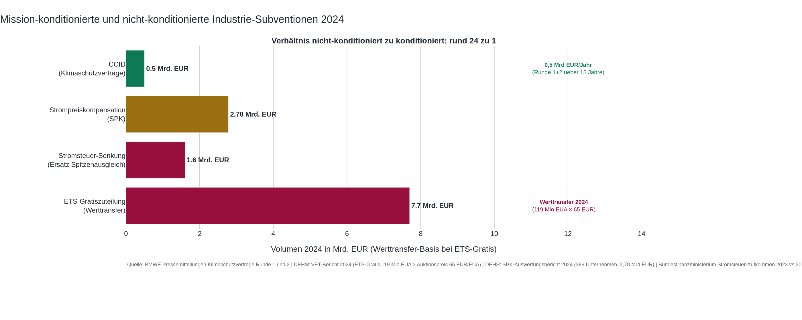
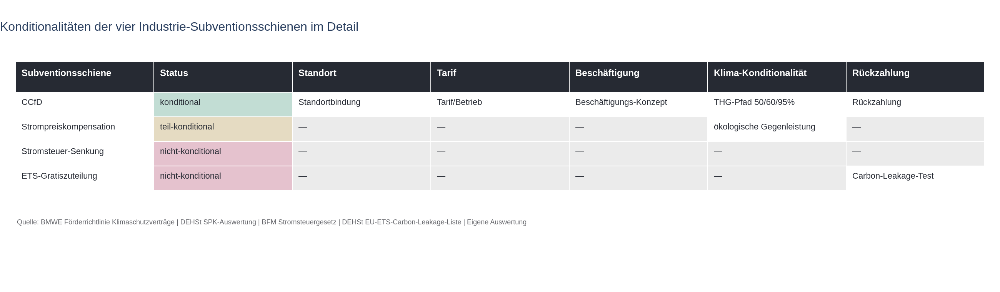
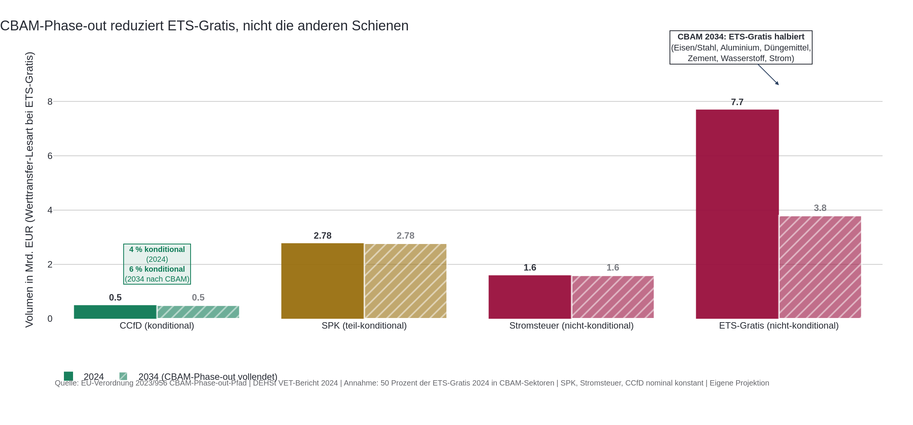
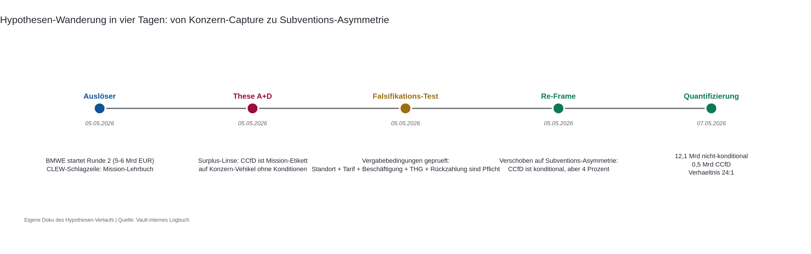

## Auslöser

Das Bundeswirtschaftsministerium hat am 5. Mai 2026 das Gebotsverfahren 2026 der CO2-Differenzvertraege gestartet, mit einem Volumen von fuenf bis sechs Milliarden Euro fuer Runde 2. Clean Energy Wire titelt am gleichen Tag "Germany launches 5-billion-euro second round of industry transition support scheme". Die Berichterstattung lobt das Programm als Mission-konformen Goldstandard deutscher Industriepolitik. Standortbindung, Tarif- oder Betriebsvereinbarung, ein scharfer THG-Pfad, Rueckzahlung wenn klimafreundliche Produktion am Markt guenstiger wird. Der DGB nennt das Modell eine Blaupause.

Die Ausgangsfrage war zunaechst eine andere. Eine fruehe Hypothesen-Skizze hatte das CCfD als Konzern-Vehikel mit Mission-Etikett vermutet, also eine progressive Verpackung fuer eine bestehende Verteilungsasymmetrie. Eine Pruefung der Foerderrichtlinie am 5. Mai 2026 hat diese Lesart widerlegt. Die Konditionen sind real, vertraglich fixiert, und der DGB ist explizit zufrieden. Damit verschiebt sich die interessante Frage. Wenn das CCfD wirklich konditional ist, warum bleibt es so klein im Verhaeltnis zum Rest der staatlichen Industrie-Stuetzung.

## Hauptbefund

Vier Subventionsschienen fliessen 2024 in die deutsche energieintensive Industrie. CCfD mit rund 0,5 Milliarden Euro durchschnittlichem Jahresvolumen. Strompreiskompensation mit 2,78 Milliarden Euro. Stromsteuer-Senkung als Ersatz fuer den Spitzenausgleich mit rund 1,6 Milliarden Euro Mindereinnahme. Und die kostenlose ETS-Zuteilung mit einem Werttransfer von 7,7 Milliarden Euro, gerechnet als 119 Millionen kostenlos zugeteilte Berechtigungen mal Auktionspreis 65 Euro.

Mission-konditioniert ist nur die erste Schiene. Standort, Tarif, Beschaeftigung, Klima-Pfad, Rueckzahlung, alle fuenf Achsen scharf gestellt. Die anderen drei haben entweder schwaechere Konditionen oder gar keine. Das macht das CCfD zu rund vier Prozent der staatlichen Industrie-Stuetzung 2024. Die uebrigen 96 Prozent fliessen ohne diese Mission-Bindung. Im Verhaeltnis ausgedrueckt: 24 zu 1 in der Werttransfer-Lesart, 9 zu 1 wenn man nur die direkten Auszahlungen ohne ETS-Gratis vergleicht, 21 zu 1 im engen Empfaengerkreis ohne Stromsteuer.



Die Pointe ist nicht, dass das CCfD schlecht ist. Es ist im Design das Beste, was die deutsche Industriepolitik 2026 anzubieten hat. Die Pointe ist die Groessenrelation. Mission-Politik wirkt am Rand des Subventions-Universums, der Hauptstrom fliesst weiter unkonditioniert. Wer das CCfD als Wende der Industriepolitik liest, verwechselt Design mit Volumen.

## Was der Mainstream-Frame verdeckt

Die uebliche Lesart ist binaer. Entweder gilt das CCfD als Mission-konformer Lehrbuch-Erfolg im Sinne von Mariana Mazzucato, also staatliche Risikouebernahme mit shared upside und harter Konditionalitaet. Oder es gilt als marktriskantes Industriepolitik-Experiment, das die Staatskasse belaste und Innovationen verzerre. Beide Positionen ringen um dasselbe Instrument und uebersehen, wie klein es ist.

Wer das CCfD lobt, sollte erklaeren, warum Mission-Konditionalitaet auf vier Prozent der Industrie-Stuetzung beschraenkt bleibt. Wer das CCfD kritisiert, sollte erklaeren, warum die nicht-konditionierten 96 Prozent kein Problem sein sollen. Beide Lesarten kommen ohne diese Frage aus, weil sie die parallel laufenden Schienen aus dem Blick lassen. ETS-Gratiszuteilung wird als technisches EU-Instrument gerahmt, nicht als nationale Industriepolitik. Strompreiskompensation gilt als Carbon-Leakage-Schutz, nicht als Subvention. Die Stromsteuer-Senkung wurde 2024 als Entlastungspaket fuer das produzierende Gewerbe debattiert, nicht als Industrie-Foerderung.

Pfadabhaengigkeit erklaert, warum das so bleibt. ETS-Gratiszuteilung und Stromsteuer-Senkung haben festgesetzte Empfaenger und Verfahren, institutionalisiert seit den 2000er Jahren. Konditionalitaet nachtraeglich einzuziehen wuerde bedeuten, mit organisierten Lobby-Kraeften zu verhandeln, deren Geschaeftsmodell auf den bestehenden Stuetzungen beruht. Das CCfD ist neu. Beim Start gab es keine festen Anspruchsgruppen, also war Mission-Konditionalitaet politisch durchsetzbar. Das ist kein Lehrbuch-Erfolg, sondern ein Befund ueber die Reihenfolge politischer Moeglichkeiten.

Auch die Empfaengerstruktur ist nicht zufaellig. Die vier oeffentlich namentlich bekannten CCfD-Empfaenger der Runde 1, also BASF, Saint-Gobain, Suedzucker und Kimberly-Clark, sind alle plausibel auch in den anderen drei Schienen vertreten. BASF ist mit mehreren Anlagen in der ETS-Gratiszuteilung, anspruchsberechtigt fuer die Strompreiskompensation seit Phase 4, und beguenstigt durch die Stromsteuer-Senkung als produzierendes Gewerbe. Aehnlich bei den anderen drei. Davon ist nur der CCfD-Anteil mission-konditioniert. Kumulative Beguenstigung ueber mehrere Schienen ist die Regel, nicht die Ausnahme.

## Wo die Reform-Diagnose wirklich liegt

Die eigentliche Diagnose ist eine Sortierung der industriepolitischen Werkzeuge nach Reformierbarkeit. Das CCfD ist nicht das Problem. Es ist das einzige Instrument, das im Design auf der Hoehe der Mission-Logik ist. Das Problem ist, dass es der einzige Hebel mit dieser Konditionalitaet ist und gleichzeitig der mit Abstand kleinste.

Drei Lehren ergeben sich daraus, die ueber das Industriepolitik-Feld hinausreichen und auch fuer die Waermewende-Finanzierung tragen.

Erstens, das Konditionalitaets-Niveau eines Foerderprogramms haengt weniger vom politischen Willen ab als vom Alter des Instruments. Neue Programme lassen sich konditionieren, alte nicht. Wer Mission-orientierte Foerderung will, muss bei der Einfuehrung scharf stellen. Nachtraeglich Tarifbindung, Standortpflicht oder Klima-Pfade in bestehende Foerderkulissen einzuziehen, ist politoekonomisch ein anderer Vorgang. Das gilt auch fuer kommunale Waermenetz-Foerderung oder die Bundesfoerderung effiziente Waermenetze. Wer dort Konditionalitaet will, muss sie in der naechsten Foerderrichtlinie verankern, nicht in der naechsten Reform-Welle.



Zweitens, der Volumeneffekt eines Mission-Instruments ist ueber seine Konditionen hinaus durch seine Groesse begrenzt. Auch ein perfekt konditioniertes Programm bleibt am Rand wirksam, wenn es vier Prozent ausmacht. Die Mazzucato-Logik unterstellt ein staatliches Akteursfeld, das die Subventionen gestaltet. Tatsaechlich gestaltet das CCfD nur einen kleinen Ausschnitt, waehrend der Rest weiterlaeuft. Die Frage ist nicht, ob das CCfD funktioniert. Die Frage ist, ob es als Hebel fuer eine breitere Reform der Industrie-Stuetzungen taugt oder als Feigenblatt vor einem unveraenderten Hauptstrom dient.

Drittens, kommunale Akteure verhandeln gegen Empfaenger, deren Verhandlungsposition durch Bundesstuetzungen vorgepraegt ist. Wer ueber industrielle Abwaerme, Waermenetz-Anschluesse oder Standortvereinbarungen mit einem mittelgrossen Industriebetrieb verhandelt, sitzt einem Akteur gegenueber, der parallel zur kommunalen Foerderung ein Vielfaches an Bundesstuetzung erhaelt, ohne dafuer Standort- oder Beschaeftigungsbindungen einzugehen. Diese Asymmetrie ist nicht der einzige Faktor in einer Verhandlung. Sie ist aber ein Faktor, der haeufig nicht offen liegt.

## Internationaler oder zeitlicher Vergleich

Ein direkter internationaler Vergleich liegt fuer diese Frage nicht in vergleichbarer Datenform vor. Die deutsche Mischung aus ETS-Gratiszuteilung, Strompreiskompensation, Stromsteuer-Senkung und CCfD ist in dieser Kombination eine deutsche Spezialitaet. Andere EU-Laender ziehen aehnliche Stuetzungen ueber andere Kanaele, mit anderen Bemessungsgrundlagen und teilweise anderen Empfaengerkreisen. Eine sauber harmonisierte Vergleichsrechnung waere ein eigenes Forschungsprojekt.

Zeitlich ist die Lage klarer. Die ETS-Gratiszuteilung soll ueber den CBAM-Phase-out 2026 bis 2034 in vier Sektoren, also Eisen und Stahl, Aluminium, Duengemittel und Zement, schrittweise auslaufen. Wer das als automatische Aufloesung der Asymmetrie liest, uebersieht zwei Punkte. Andere nicht-konditionierte Schienen wie Strompreiskompensation und Stromsteuer-Senkung werden parallel ausgeweitet oder bleiben unveraendert. Und der CBAM-Phase-out greift nur in den vier Sektoren, nicht in den uebrigen ETS-pflichtigen Branchen. Das Bild verschiebt sich also langsam, aber nicht im Verhaeltnis 24 zu 1 in Richtung CCfD. Eine konservative Projektion mit dem Annahme, dass rund die Haelfte der ETS-Gratiszuteilung 2024 in CBAM-Sektoren faellt und die anderen drei Schienen nominal konstant bleiben, fuehrt 2034 zu einem konditional-Anteil von 6 Prozent statt heute 4 Prozent. Die Asymmetrie verschwindet nicht, sie verkleinert sich um zwei Prozentpunkte.



## Was die Untersuchung im Verlauf gelernt hat

Die Hypothese ist im Verlauf zweimal gewandert. Anfang Mai 2026 war sie zunaechst als Konzern-Vehikel-Diagnose formuliert. Annahme: Das CCfD sei Mission-Etikett ohne echte Konditionalitaet, also progressives Marketing fuer eine bestehende Verteilungsasymmetrie. Diese Lesart liess sich in einer Vergabebedingungs-Pruefung am 5. Mai 2026 nicht halten. Standortbindung, Tarif- oder Betriebsvereinbarung, der THG-Pfad und die Rueckzahlungsklausel sind in der Foerderrichtlinie real verankert. Der DGB hat die sozialen Konditionen als Blaupause bezeichnet. Die Konzern-Capture-These war damit empirisch zu schwach.

Was uebrig blieb, war die strukturelle Beobachtung aus der ursprünglichen Surplus-orientierten Linsenarbeit, dass parallele fossile Subventionsstroeme nicht abgeschmolzen werden. Daraus ist die jetzige Hypothese geworden, die nicht mehr ueber das Design des CCfD streitet, sondern ueber seine Groessenrelation. Die Hypothese ist damit von einer politisch-rhetorischen These auf eine quantitative These verschoben.

Im Verlauf der Analyse selbst wurde dann ein zweiter Punkt geschaerft. Die ursprungliche Hypothese hatte die nicht-konditionierten Schienen mit rund 12 Milliarden Euro angesetzt, bei einem Strompreiskompensations-Wert von einer Milliarde Euro. Der DEHSt-Auswertungsbericht 2024 weist tatsaechlich 2,78 Milliarden Euro fuer die Strompreiskompensation aus, deutlich hoeher. Die Stromsteuer-Senkung ist im Vault mit 1,6 Milliarden Euro Mindereinnahme aus dem Bundesfinanzministerium-Aufkommen 2023 und 2024 belegt, waehrend der Gesetzentwurf zur Stromsteuer-Senkung mit einem Brutto-Entlastungsvolumen von rund 3 Milliarden Euro rechnet. Beide Zahlen sind methodisch plausibel, sie messen unterschiedliche Dinge. Die hier verwendete Variante ist die realisierte Mindereinnahme, nicht das geplante Bruttovolumen.



## Grenzen und offene Punkte

Vier Caveats schwaechen die Aggregation, ohne den Hauptbefund zu kippen.

Der ETS-Gratis-Werttransfer ist eine Opportunitaetskosten-Rechnung, kein Bundeshaushaltsbetrag. Wer fragt, was die Industrie zahlen muesste, wenn sie die Berechtigungen am Markt kaufen wuerde, kommt auf 7,7 Milliarden Euro. EU-rechtlich ist die Gratiszuteilung nach Art. 10a ETS-Richtlinie ausdruecklich keine staatliche Beihilfe im Sinne des AEUV Art. 107, weil sie aus einem harmonisierten EU-Instrument stammt. Das diskreditiert den Wertvergleich nicht, es verengt nur die rechtliche Kategorie. Wer den engen direkten Auszahlungs-Vergleich bevorzugt, kommt auf rund 4,4 Milliarden Euro Strompreiskompensation plus Stromsteuer-Mindereinnahme, also Verhaeltnis 9 zu 1 statt 24 zu 1.

Das CCfD-Jahresvolumen von rund 0,5 Milliarden Euro ist eine Mittelung der Maximalsubvention ueber 15 Jahre Vertragslaufzeit, kein Erwartungswert der tatsaechlichen Auszahlung. Die Auszahlung fliesst nur, wenn der vereinbarte Strikepreis ueber dem ETS-Marktpreis liegt. 2024 lag der ETS-Durchschnittspreis bei rund 65 Euro je Berechtigung. Die Strikepreise der Runde-1-Vertraege sind nicht oeffentlich, wurden im Bieterwettbewerb aber tendenziell nach unten gedrueckt. In einem Hochpreis-ETS-Jahr wie 2024 duerfte die reale CCfD-Auszahlung deutlich unter dem Mittelwert gelegen haben, moeglicherweise nahe null. Das verstaerkt den Hauptbefund, schwaecht aber die Mittelwert-Lesart.

Die Empfaengerabgrenzung ist ueber die vier Schienen unterschiedlich breit. ETS-Gratiszuteilung und Strompreiskompensation adressieren ausschliesslich Carbon-Leakage-Sektoren der energieintensiven Stamm-Industrie. CCfD adressiert sieben CO2-intensive Branchen, aehnlich eng. Stromsteuer-Senkung gilt jedoch fuer alle rund 8.800 Betriebe des produzierenden Gewerbes nach Stromsteuergesetz, also Sektoren von der Druckerei bis zum Stahlwerk. Die Stromsteuer-Senkung ist damit eine Universalentlastung des produzierenden Gewerbes, nicht ein sektorspezifisches Instrument. Im engen Empfaengerkreis ohne Stromsteuer schrumpft das Verhaeltnis auf rund 21 zu 1 in der Werttransfer-Lesart.

Das Empfaenger-Matching zwischen den vier Schienen ist nur qualitativ. Eine quantitative Aussage ueber kumulative Beguenstigung pro Konzern ueber alle vier Kanaele wuerde Firmennamen-Normalisierung ueber die DEHSt-Anlagenliste mit rund 1.700 Anlagen, die SPK-Liste mit 366 Unternehmen und die CCfD-Vergabebescheide erfordern. Die hier behauptete Konzentration ist plausibel und durch die vier oeffentlich bekannten CCfD-Empfaenger gestuetzt, aber nicht in einer kompletten Uebereinstimmungsmatrix belegt.

---

## Anhang A: Datenbasis und Vorgehen

Die Untersuchung verbindet vier oeffentliche Aggregate aus Bundesbehoerden mit einer Konsistenzpruefung gegen einen externen Recherchelauf. Drei Schienen sind ueber DEHSt-Berichte direkt belegt, eine ueber die Aufkommensreihe des Bundesfinanzministeriums. Der vierte Posten, das CCfD-Jahresvolumen, kommt aus den BMWE-Pressemitteilungen zu Runde 1 und Runde 2.

Die Aggregations-Logik laeuft in vier Schritten. Zuerst werden die vier Schienen auf eine vergleichbare Volumenbasis 2024 normalisiert. Das CCfD-Volumen wird als Maximalsubvention der Runden 1 und 2 zusammen ueber 15 Jahre Vertragslaufzeit gemittelt, also 2,8 Milliarden Euro plus 5 Milliarden Euro geteilt durch 15 Jahre, was rund 520 Millionen Euro pro Jahr ergibt. Die Strompreiskompensation wird mit der DEHSt-Bewilligungssumme fuer das Abrechnungsjahr 2024 angesetzt, also 2,78 Milliarden Euro fuer 366 Unternehmen mit 729 Anlagen. Die Stromsteuer-Mindereinnahme ergibt sich aus der Differenz des Stromsteueraufkommens 2023 zu 2024, also 6,8 minus 5,2 gleich 1,6 Milliarden Euro, nach der Senkung auf den EU-Mindeststeuersatz von 0,50 Euro pro Megawattstunde. Der ETS-Gratis-Werttransfer ergibt sich aus 119 Millionen kostenlos zugeteilten Berechtigungen mal dem EUA-Auktionspreis 2024 von 65 Euro, gleich 7,7 Milliarden Euro.

Im zweiten Schritt werden die Schienen nach Konditionalitaets-Status klassifiziert. Fuenf Achsen, also Standort, Tarif- oder Betriebsvereinbarung, Beschaeftigung, Klima-Pfad, Rueckzahlungsklausel. Das CCfD ist auf allen fuenf Achsen konditional. Die Strompreiskompensation hat seit den ueberarbeiteten CEEAG-Beihilfeleitlinien Energieaudit- und Dekarbonisierungsauflagen, also schwache Konditionalitaet auf der Klima-Achse, aber keine Standort-, Tarif- oder Beschaeftigungsbindung. ETS-Gratiszuteilung und Stromsteuer-Senkung sind auf allen fuenf Achsen unkonditioniert.

Im dritten Schritt werden zwei Vergleichsverhaeltnisse gerechnet. Die Werttransfer-Lesart inklusive ETS-Gratis ergibt 12,1 Milliarden Euro nicht-konditional plus teil-konditional gegen 0,5 Milliarden Euro CCfD, also 24 zu 1. Die enge direkte Auszahlungslesart ohne ETS-Werttransfer ergibt 4,4 Milliarden Euro gegen 0,5, also 9 zu 1. Im engen Empfaengerkreis ohne Stromsteuer ergibt sich 21 zu 1 als Werttransfer-Wert oder 6 zu 1 als direkter Wert. Drei Verhaeltnisse, alle methodisch sauber, sie messen unterschiedliche Dinge.

Im vierten Schritt wird der Befund gegen die externe Recherche und gegen den Argument-Review gehaertet. Der externe Recherchelauf hat die Strompreiskompensations-Zahl auf 2,78 Milliarden Euro nach oben korrigiert, die Konditionalitaets-Klassifikation der SPK auf schwach konditional verschaerft und die Beihilfe-Einordnung der ETS-Gratiszuteilung praezisiert. Der Argument-Review hat die rechtliche Einordnung der ETS-Gratiszuteilung von beihilferechtlich konsistent auf opportunitaetskostenbasiert korrigiert. Beide Korrekturen sind in die jetzige Aggregation eingearbeitet.

Ausgenommen sind Verkehr, also die Lkw-Maut-Differenzierung, Landwirtschaft, also die Diesel-Rueckerstattung, und Gebaeude, also die Bundesfoerderung effiziente Gebaeude. Auch ausgenommen ist die Kohle-Strukturhilfe von 40 Milliarden Euro ueber 14 Jahre, weil sie regional an Strukturwandel-Akteure fliesst und nicht an die hier betrachtete energieintensive Stamm-Industrie.

## Anhang B: Verformelung der Berechnung

```text
ets_gratis_werttransfer_eur(jahr)
    = sum( zugeteilte_eua(anlage, jahr) ) * eua_auktionspreis_eur(jahr)

ets_gratis_werttransfer_eur(2024) = 119_000_000 * 65 EUR/EUA
                                  = 7_735_000_000 EUR

ccfd_jahresvolumen_eur(jahr_ab_2026)
    = (max_subvention_runde_1 + max_subvention_runde_2) / vertragslaufzeit_jahre
    = (2_800_000_000 + 5_000_000_000) / 15
    = 520_000_000 EUR/Jahr

stromsteuer_mindereinnahme_eur(2024)
    = stromsteuer_aufkommen_eur(2023) - stromsteuer_aufkommen_eur(2024)
    = 6_800_000_000 - 5_200_000_000
    = 1_600_000_000 EUR

spk_eur(2024) = 2_780_000_000 EUR
    (DEHSt-Auswertungsbericht 2024, 366 Unternehmen, 729 Anlagen)

verhaeltnis_breit_werttransfer
    = (ets_gratis + spk + stromsteuer_senkung) / ccfd_jahresvolumen
    = (7,7 + 2,78 + 1,6) / 0,5
    = 24,2

verhaeltnis_direkt_ohne_werttransfer
    = (spk + stromsteuer_senkung) / ccfd_jahresvolumen
    = (2,78 + 1,6) / 0,5
    = 8,8

verhaeltnis_eng_ohne_stromsteuer (CL-Sektoren plus CCfD-Sektoren)
    = (ets_gratis + spk) / ccfd_jahresvolumen
    = (7,7 + 2,78) / 0,5
    = 21,0     (Werttransfer)
    bzw. spk / ccfd = 2,78 / 0,5
    = 5,6      (direkt)

ccfd_anteil_an_summe_2024
    = ccfd_jahresvolumen / (ccfd + spk + stromsteuer_senkung + ets_gratis)
    = 0,5 / 12,6
    = 4,0 Prozent
```

Filterregel: Nur Subventionen fuer die deutsche stationaere energieintensive Industrie 2024. Ausgenommen Verkehr, Landwirtschaft, Gebaeude und Kohle-Strukturhilfe.

## Quellen und Verweise

**Eigene Auswertung im Arbeitsvault**
- Hypothese: `Hypotheses/2026-05-05_ccfd-mission-vs-konzern-asymmetrie.md`
- Surplus-Linsen-Review: `Hypotheses/reviews/2026-05-05_ccfd-mission-vs-konzern_surplus.md`
- Analyse: `Analyses/2026-05-07_ccfd-subventions-achsen-vergleich.md`
- Deep-Research-Result: `DeepResearch/results/2026-05-07_ccfd-subventions-asymmetrie_parallel.md`
- Deep-Research-Review: `DeepResearch/reviews/2026-05-07_ccfd-subventions-asymmetrie_review.md`
- Argument-Review: `Posts/reviews/2026-05-07_ccfd-subventions-asymmetrie_argument-review.md`

**Externe Primaerquellen**
1. BMWE, Pressemitteilung 05.05.2026, "Gebotsverfahren 2026 der CO2-Differenzvertraege": https://www.bundeswirtschaftsministerium.de/Redaktion/DE/Pressemitteilungen/2026/05/20260505-bmwe-startet-gebotsverfahren-2026-der-co2-differenzvertraege.html
2. BMWK, Pressemitteilung 15.10.2024, "Habeck uebergibt erste Klimaschutzvertraege": https://www.bundeswirtschaftsministerium.de/Redaktion/DE/Pressemitteilungen/2024/10/20241015-habeck-uebergibt-erste-klimaschutzvertraege.html
3. BMWK, Pressemitteilung 24.03.2025, "Klimaschutzvertraege: Europaeische Kommission genehmigt Foerdergrundlage zweite Gebotsrunde": https://www.bundeswirtschaftsministerium.de/Redaktion/DE/Pressemitteilungen/2025/20250324-klimaschutzvertraege-europaeische-kommission-genehmigt-foerdergrundlage-zweite-gebotsrunde.html
4. DEHSt, VET-Bericht 2024, "Emissions Situation in EU ETS 1 in 2024 - Stationary Installations": https://www.dehst.de/SharedDocs/downloads/EN/publications/2024_VET-Report.pdf
5. DEHSt, Auktionsbericht 2024, "German Auctioning of Emission Allowances - Annual Report": https://www.dehst.de/SharedDocs/downloads/EN/auctioning/2024/2024_annual-report.pdf
6. DEHSt, SPK-Auswertungsbericht 2024, "Beihilfen fuer indirekte CO2-Kosten des Europaeischen Emissionshandels": https://www.dehst.de/SharedDocs/downloads/DE/spk/Auswertungsbericht_2024.pdf
7. Stromsteuergesetz (StromStG): https://www.gesetze-im-internet.de/stromstg/BJNR037810999.html
8. Deutscher Bundestag, Drucksache 21/1866, Gesetzentwurf zur Stromsteuer: https://dserver.bundestag.de/btd/21/018/2101866.pdf
9. EU-Kommission, CEEAG-Leitlinien fuer staatliche Klima-, Umweltschutz- und Energiebeihilfen: https://eur-lex.europa.eu/legal-content/DE/TXT/PDF/?uri=CELEX:52022XC0218(03)
10. CLEW Daily 05.05.2026, "Germany launches 5-billion-euro second round of industry transition support scheme": https://www.cleanenergywire.org/news
