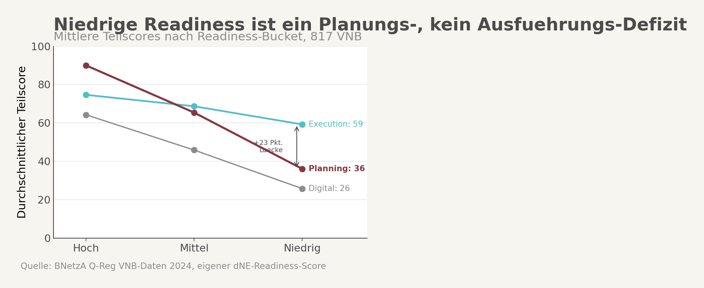
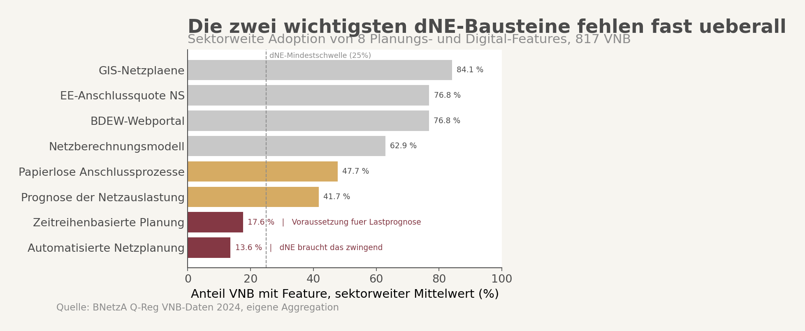
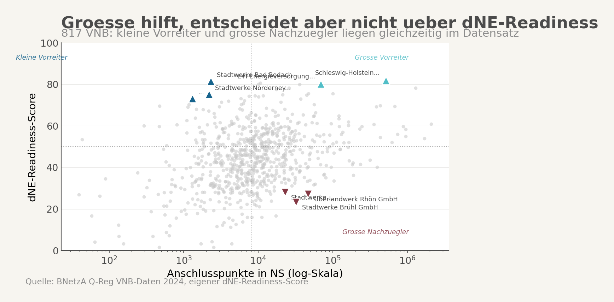

## Auslöser

Aurora schrieb Ende April 2026, eine Umsetzung dynamischer Netzentgelte auf der Ebene der Verteilnetzbetreiber sei wegen Zahl der Akteure, Datenpunkte und Schnittstellen praktisch kaum vorstellbar. Gleichzeitig zeigt das AGNES-Handout der Bundesnetzagentur, dass die Debatte nicht im Seminarraum bleibt, sondern in Richtung konkreter Reformpfad ab 2029 läuft. Das ist der Punkt, an dem die Frage kippt: nicht mehr ob dNE theoretisch effizient sein könnte, sondern ob die VNB-Schicht sie operativ überhaupt fahren kann.

## Ausgangspunkt

Die öffentliche Debatte über dynamische Netzentgelte wird meistens wie eine Preisdebatte geführt. Wer gewinnt regional, wer verliert, was passiert mit Redispatch, wie stark werden Standorteffekte. Die VNB-Perspektive sitzt davor. Wenn die Betreiber regionaler Netze Forecasting, Zeitreihenlogik, Marktkommunikation und abrechenbare Kundenschnittstellen nicht stabil zusammenbekommen, hilft die beste Tarifarchitektur wenig.

Der erste dNE-Readiness-Score für 817 VNB war deshalb kein Ranking aus Neugier, sondern ein Vorabtest auf Umsetzbarkeit. Das Ergebnis ist unangenehm klar: Der Median liegt bei 44,7 Punkten, nur 31 VNB kommen über 70, und der größte Abstand sitzt bei Planung, nicht bei Ausführung.

## Wie die Hypothese entstanden ist

Die Ausgangsintuition war simpel. Kleine und mittlere Stadtwerke-VNB dürften bei dNE schwacher aufgestellt sein als große Verbundakteure. Das lag nahe: weniger Skalenvorteile, weniger IT-Personal, weniger Budget für Forecasting und Leitsysteme.

Dann kamen die Gegenhypothesen. Erstens: Kleine VNB können Shared Services, Dienstleister oder Plattformen einkaufen. Zweitens: Gerade große VNB könnten an Legacy-Systemen hängen. Drittens: Die sichtbarsten Kundenschnittstellen, also Portale, Smart-Meter-Seiten und Netzanschluss-Frontends, könnten den Reifegrad überschätzen.

Genau deshalb lohnte sich die Analyse. Wenn der Score nur Größe reproduziert, ist er analytisch schwach. Wenn kleine Betreiber weit oben und große weit unten auftauchen, muss genauer hingeschaut werden.

## Datenbasis

Die Auswertung basiert auf fünf VNB-Datensätzen aus dem BNetzA- und Q-Reg-Umfeld: Digitalisierungs-Indikatoren für 815 Verteilnetzbetreiber, Umsetzungsquoten für 817, Anschlussdauern für 817, Netzstruktur-Kennzahlen für 817 und Stammdaten für 701.

Aus diesen fünf Datensätzen entsteht ein gemeinsamer readiness-score, ergänzt um einen confidence-score zur Datenabdeckung und um eine separate Größenklasse als Segment-Variable. Die drei Dimensionen sind bewusst getrennt:

1. der readiness-score als Fähigkeits-Proxymass
2. der confidence-score als Datenabdeckung
3. die Größenklasse als Segment, nicht als Score-Komponente

## Vorgehen

Der Score besteht aus drei Schichten. `Digital` geht mit 45 Prozent ein, `Planung` mit 35 Prozent, `Execution` mit 20 Prozent. Wichtig war dabei eine saubere Trennung: Größe sollte nicht direkt den Score hochtreiben, und fehlende Daten sollten nicht stillschweigend wie Null-Kompetenz behandelt werden.

Die Planungsseite misst deshalb nicht irgendein allgemeines Digitalisierungsgefühl, sondern konkrete Dinge: GIS-basierte Netzpläne, Netzberechnungsmodell, automatisierte Netzplanung, Prognose der Netzauslastung und zeitreihenbasierte Planung. Auf der Execution-Seite laufen Umsetzungsquoten und Anschlussdauern hinein. Danach kam der entscheidende zweite Schritt: die Plausibilisierung der Ausreißer mit öffentlichen Unternehmenssignalen.

## Ergebnisse



Der erste Hauptbefund ist sektorweit: dNE-Readiness ist vor allem ein Planungsproblem. In der Low-Readiness-Gruppe liegt der Execution-Score im Mittel noch bei 59,3, der Planning-Score aber nur bei 36,1. Bei den sektorweiten Einzelbausteinen fallen `automatisierte Netzplanung` mit 13,6 Prozent und `zeitreihenbasierte Planung` mit 17,6 Prozent besonders ab.



Der zweite Hauptbefund ist gegen die einfache Größengeschichte gerichtet. Der Zusammenhang zwischen `readiness_score` und `ns_points` ist schwach, auf Log-Skala nur moderat (`0,34`). Viel enger am Gesamtbild liegen `planning_score` (`0,93`) und `digital_score` (`0,92`). Anders gesagt: Größe hilft, aber sie erklärt die Unterschiede nicht gut genug.



Dafür sprechen die drei robustesten Beispiel-Fälle.

### Fall 1: Schleswig-Holstein Netz als Benchmark oben

Schleswig-Holstein Netz kommt auf `81,8` Punkte. Das passt zum öffentlichen Bild: Einspeisemanagement mit Online-Tabelle, Hausanschlussportal, Onlineportale für Installateure, hohe Einspeisekomplexität, mehrere Netzebenen. Das ist kein Überraschungsfall, sondern der Erwartungsanker dafür, wie ein dNE-naher Betreiber aussehen sollte.

### Fall 2: Bad Rodach als kleiner Plattformfall

Stadtwerke Bad Rodach kommen mit nur `2.316` NS-Anschlusspunkten auf `81,5` Punkte. Öffentlich sichtbar sind ein dynamischer Tarif seit dem `1. Januar 2025`, `iMSys` als Voraussetzung, ein `§14a`-Preisblatt mit `Modul 3` und eine Wilken-nahe EDIFACT-Marktkommunikation. Das ist wichtig, weil es die Story dreht: Kleinheit allein ist kein Hindernis, solange der Backend-Stack steht oder mitgekauft wird.

### Fall 3: Regensburg Netz als großer Transformationsfall

Regensburg Netz liegt trotz `55.436` NS-Anschlusspunkten bei `31,6` Punkten. Öffentlich meldete das Unternehmen am `30. April 2025` eine große Umstellung der internen Softwarelandschaft. Beim Einbau intelligenter Messsysteme war Anfang 2025 von einer stabilen Wiederaufnahme erst ab `Juli 2025` die Rede. Genau das ist der Typ Fall, den der Score finden soll: groß, professionell, sichtbar digital. Und intern trotzdem nicht weit genug.

Diese drei Fälle reichen für die Kernaussage bereits aus. Kleine Betreiber können mit Plattformen weit vorne liegen. Große Betreiber können in IT-Umbauten hängen. Die Trennlinie verläuft damit eher zwischen tief integrierter Planungs- und Prozessschicht einerseits und kundenseitigem Frontend andererseits.

## Was das für die Hypothese bedeutet

Die Hypothese ist im Kern bestätigt, aber sie muss präziser formuliert werden.

Die erste Version hieß sinngemäß: Kleine und mittlere VNB werden dNE bis 2030 oft nicht schaffen. Die bessere Version lautet: Ein großer Teil der VNB wird dNE ohne tiefere Planungs-, Daten- und Prozessreife nicht schaffen, und diese Reife ist nur teilweise eine Größenfrage.

Das ist ein wichtiger Unterschied. Er macht aus einer einfachen Stadtwerke-Asymmetrie eine Backend- und Plattform-Asymmetrie. Genau deshalb ist Bad Rodach kein Gegenbeweis, sondern ein Schlüsselfall. Wenn kleine VNB über Shared Services nach oben kommen, dann muss Regulierung auf diese Ebene zielen. Nicht auf moralische Appelle an "mehr Digitalisierung".

## Grenzen und offene Punkte

Der Score bleibt ein Proxy-Modell. Er misst sichtbare Reife in bereits erhobenen VNB-Daten, keinen offiziellen BNetzA-Indikator. Die Gewichtung ist analytisch begründet, aber gesetzt. Andere Gewichte wären vertretbar.

Der zweite große Vorbehalt ist der Zeitversatz. Die Rohdaten stammen primär aus 2024. Mehrere Websignale der Plausibilisierung stammen aus 2025 oder 2026. Brühl ist dafür das beste Beispiel: Im Datensatz niedrig, auf der Website inzwischen sichtbar im Umbau und in der Digitalisierung der Ortsnetzstationen. Das muss kein Fehler sein, sondern kann eine laufende Aufholphase spiegeln.

Der dritte Vorbehalt ist fehlende Sichtbarkeit von Shared Services. Wenn ein kleiner VNB Forecasting, Marktkommunikation oder Portalebene systematisch über Plattformpartner einkauft, taucht das derzeit nur indirekt im Score auf. Genau dort liegt der nächste Ausbau.

## Verformelung der Berechnung

```text
readiness_score = 0,45 * digital_score
                + 0,35 * planning_score
                + 0,20 * execution_score

digital_score =
  Datenmanagement und Analyse
  + Digitale Prozesse und Systeme
  + Smart Grids
  + Kundenmanagement / Webportale

planning_score =
  GIS-Netzpläne
  + Netzberechnungsmodell
  + automatisierte Netzplanung
  + Prognose der Netzauslastung
  + zeitreihenbasierte Planung

execution_score =
  Umsetzungsquote EE-Anschlüsse NS
  + Umsetzungsquote Verbrauchseinrichtungen/Speicher NS
  + inverse Anschlussdauern
  + papierlose Prozesse
  + BDEW-Webportal

Fehlende Felder:
  werden aus dem jeweiligen Teilscore herausnormalisiert
  und nicht als Null-Kompetenz behandelt.
```

## Quellen und Verweise

- [2026-05-03_vnb-dne-readiness-precheck](../vnb-dne-readiness-precheck/)
- [2026-05-03_vnb-dne-readiness-plausibilisierung](../vnb-dne-readiness-plausibilisierung/)
- [2026-05-03_dne-vnb-implementierungsluecke](../dne-vnb-implementierungsluecke/)
- [2026-04-30_aurora_dynamische-netzentgelte](../aurora-dynamische-netzentgelte/)
- [2026-04-27_agnes_handout-bnetza-netzentgeltreform](../agnes-handout-bnetza-netzentgeltreform/)
- https://www.sh-netz.com/de.html
- https://www.stw-bad-rodach.de/strom/stromtarife-bad-rodach/
- https://www.stw-bad-rodach.de/wp-content/uploads/2025/07/Netznutzungsvertrag-Anlagen.pdf
- https://www.regensburg-netz.de/kundeninfo-umstellung-it-systeme
- https://www.regensburg-netz.de/kundeninfo-ims
- Chart-Skript: `/home/msr/projects/maxbrain-analyses/src/viz/vnb_dne_readiness_charts.py`
- Build-Skript: `/home/msr/projects/maxbrain-analyses/scripts/build_vnb_dne_readiness.py`
