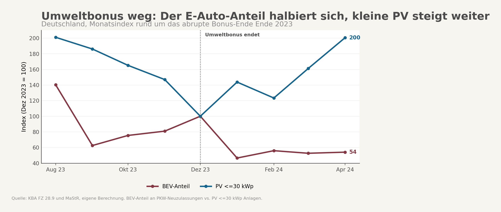
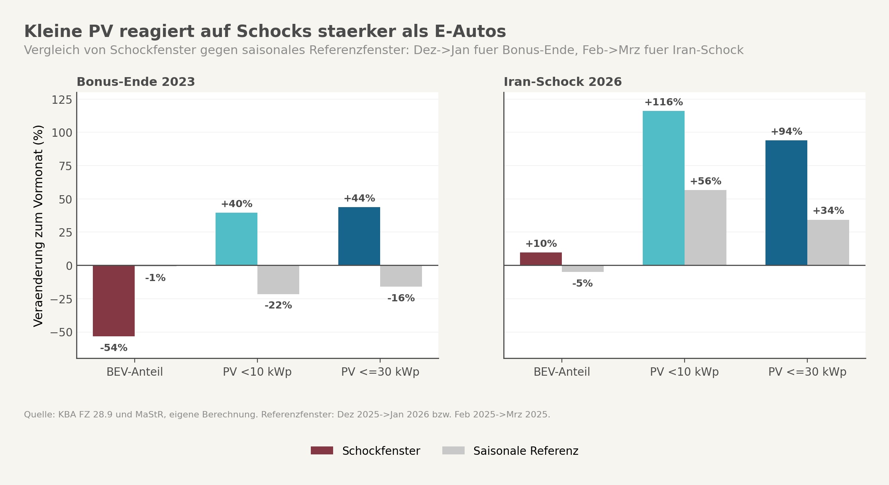
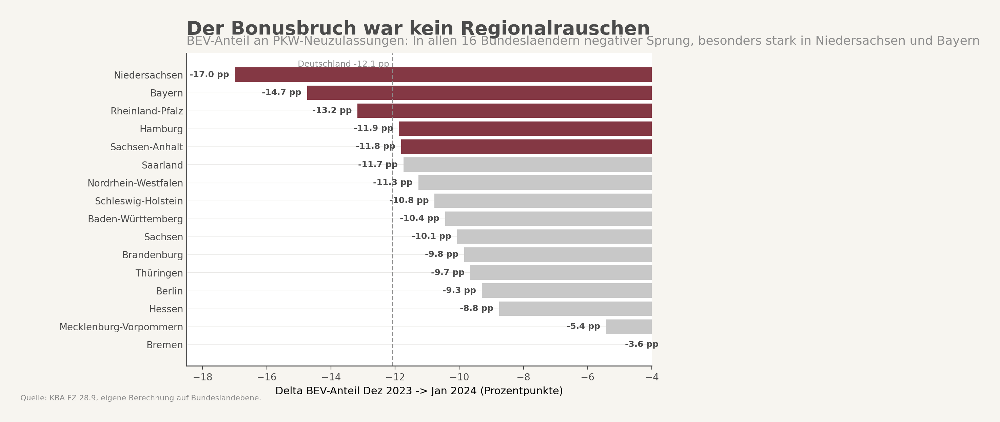

## Auslöser

Der Ausgangspunkt war kein einzelner Medienhype, sondern eine auffällige Kombination aus Verwaltungsentscheidung und Monatsdaten. Die BAFA beendete den Umweltbonus mit Ablauf des 17. Dezember 2023 abrupt. Wenige Wochen später meldete das Kraftfahrt-Bundesamt für Januar 2024 nur noch 22.474 neue batterieelektrische Pkw und einen BEV-Anteil von 10,5 Prozent. Im Dezember 2023 waren es noch 22,6 Prozent gewesen. Im gleichen Monatswechsel zog der Zubau kleiner Photovoltaik-Anlagen im Marktstammdatenregister nach oben.

Aus dieser Gegenbewegung entstand die eigentliche Frage. Wenn Haushalte unter Preis- und Unsicherheitsdruck in die private Energiewende investieren, warum landet der Impuls seit Ende 2023 zuerst auf dem Dach und nicht auf der Straße. Der Iran-Schock im Frühjahr 2026 lieferte dann ein zweites Testfenster für dieselbe Frage.

## Hauptbefund

Die Monatsdaten bestätigen eine klare Asymmetrie. Im harten Policy-Fenster Dezember 2023 zu Januar 2024 halbiert sich der BEV-Anteil an allen neuen Pkw von 22,6 auf 10,52 Prozent. Das ist ein Rückgang um 53,5 Prozent. Gleichzeitig steigen kleine PV-Anlagen weiter. Anlagen unter 10 Kilowatt legen um 39,5 Prozent zu, Anlagen bis 30 Kilowatt um 43,7 Prozent. Die private Energiewende reagiert also nicht als einheitlicher Block, sondern segmentiert.

Wichtig ist, was dieser Bruch nicht ist. Er ist kein normaler Januar-Effekt. Im Referenzwechsel Dezember 2025 zu Januar 2026 fällt der BEV-Anteil nur um 1,0 Prozent. Kleine PV fällt dort sogar leicht. Der Januar 2024 war deshalb kein bloßer Kalendereffekt, sondern ein Regimewechsel unmittelbar nach dem abrupten Förderende.

Wichtig ist auch, was dieser Bruch ebenfalls nicht ist. Er ist kein sauberer Beweis für einen reinen Nachfragekollaps. Gegenüber Januar 2023 lagen die BEV-Neuzulassungen im Januar 2024 laut KBA noch im Plus. Der Dezember 2023 war also ein politisch erzeugter Vorziehmonat. Genau deshalb ist die stärkste Lesart nicht "Markt tot ab Januar", sondern: Die Förderarchitektur hat einen massiven Dezember-Januar-Bruch erzeugt, den kleine PV im gleichen Moment nicht teilt.



Der zweite Testpunkt bestätigt die Richtung, auch wenn er noch nicht ausreicht, um Kausalität zu behaupten. Im ersten Iran-Fenster Februar 2026 zu März 2026 steigen sowohl E-Autos als auch kleine PV. Aber nicht annähernd gleich stark. Der BEV-Anteil steigt um 9,7 Prozent. PV bis 30 Kilowatt steigt um 93,8 Prozent. Gegen das saisonale Vergleichsfenster Februar 2025 zu März 2025 bleibt auch danach ein deutlicher Zusatzimpuls übrig. Preis-Schocks mobilisieren also beide Technologien, aber seit dem Bonus-Ende sehr ungleich.

## Was der Mainstream-Frame verdeckt

Der übliche EV-Frame erzählt die Geschichte als Förderschock plus Unsicherheit. Die Förderung fällt weg, also kaufen die Leute weniger Autos. Das stimmt, aber es reicht nicht. Denn die Monatsreihe misst nicht einfach "Haushaltsreaktion". Der Neuwagenmarkt ist strukturell kein reiner Haushaltsmarkt. Laut DAT liefen 2024 nur 32,5 Prozent aller neuen Pkw auf private Halter. Der Rest ist Flotte, Leasing, Handel oder gewerblicher Kanal. Wer die Januar-Kante eins zu eins als privaten Stimmungsindikator liest, liest ein Mischsignal.

Der zweite verkürzte Frame lautet, Energiepreis-Schocks würden die private Energiewende generell anschieben. Auch das ist zu glatt. Die Daten zeigen gerade keine gleichgerichtete Reaktion beider Haushaltstechnologien. Sie zeigen, dass dieselbe Krisenlage auf zwei sehr unterschiedliche Investitionsobjekte trifft. Das Auto bleibt das deutlich sperrigere Gut. Es braucht mehr Kapital, längere Entscheidungszyklen, oft Finanzierung oder Leasing und seit Ende 2023 keine direkte Kaufprämie mehr.

ADAC-Daten verschärfen diesen Punkt. Selbst nachdem Hersteller 2024 teils Rabatte von mehreren tausend Euro auf E-Autos gaben, blieb das Niveau privater E-Auto-Zulassungen niedrig. Das ist analytisch wichtiger als der rohe Monatsbruch. Wenn selbst Bonus-Ersatz über Rabatte die private Seite nicht zurück auf das alte Niveau bringt, liegt die Hürde tiefer als bei einer bloßen Preisdifferenz im Showroom.

Kleine PV funktioniert anders. Sie ist für Haushalte ebenfalls investiv, aber modularer. Die Projektgröße ist kleiner, die Aktivierung schneller, die Entscheidung direkter an die Stromrechnung gekoppelt. Genau deshalb ist die PV-Reaktion aussagekräftiger als unmittelbarer Haushaltsindikator. Der EV-Markt läuft durch zusätzliche Filter. Die PV-Seite läuft näher an echter Haushaltsinvestition.



## Wo die Reform-Diagnose wirklich liegt

Die eigentliche Diagnose ist eine Förderasymmetrie innerhalb der privaten Energiewende. Seit Ende 2023 stehen zwei Technologien unter demselben Preis- und Unsicherheitsdruck, aber nur eine hat ihre direkte Kaufprämie verloren. Der Staat hat die Eintrittsschwelle nicht überall gleich verändert. Beim Auto wurde sie abrupt erhöht. Bei kleiner PV blieb sie indirekter, verteilter und für Haushalte operativ leichter erreichbar.

Das macht Preis-Schocks politisch asymmetrisch wirksam. Ein Haushalt, der wegen Stromkosten, geopolitischer Unsicherheit oder neuer Förderdebatten handeln will, kommt schneller auf das Dach als an ein neues Auto. Das ist keine Mentalitätsfrage, sondern eine Frage von Kapitalbedarf, Entscheidungsdauer und Policy-Design. Wer diese Asymmetrie übersieht, verwechselt "grüne Kaufbereitschaft" mit "umsetzbarer Investition".

Der Befund wird sogar dadurch schärfer, dass 2026 kein klassisches Hochpreisumfeld mehr vorliegt. Die offizielle BDEW-Strompreisanalyse für Januar 2026 weist für Haushalte 37,2 Cent je Kilowattstunde aus, also weniger als in den Hochpreisjahren davor. Kleine PV springt damit nicht in einem perfekten Preisumfeld an, sondern trotz schwächerem Endkundenpreisanker. Das spricht nicht gegen die These, sondern macht sie härter: Wenn PV unter diesen Bedingungen dennoch sensibler reagiert als E-Autos, ist das EV-Hindernis strukturell.

Es gibt allerdings einen zweiten Politikkanal auf der PV-Seite. Der Bundesverband Solarwirtschaft verweist im Frühjahr 2026 zugleich auf die jüngste Energiekrise und auf erwartete Kürzungen bei der Solarförderung. Auch kleine PV reagiert also nicht nur auf Strompreise, sondern auf die Aussicht, dass das Förderfenster enger werden könnte. Die richtige Lesart ist deshalb nicht "Haushalte reagieren nur auf Preise", sondern: Haushalte reagieren dort am stärksten, wo Preis- und Fördererwartung schnell in eine machbare Investition übersetzt werden können.

## Internationaler oder zeitlicher Vergleich

Ein belastbarer Ländervergleich liegt für diese Frage noch nicht vor. Die vorhandenen Daten reichen nicht, um Frankreich, die Niederlande oder Großbritannien seriös neben Deutschland zu legen. Die bessere Kontrastfolie ist deshalb bisher zeitlich und regional.

Zeitlich ist der Befund robust. Der Wechsel Dezember 2023 zu Januar 2024 sieht völlig anders aus als der gleiche Monatswechsel ein Jahr später. Der EV-Markt fällt im Referenzjahr kaum, kleine PV fällt dort sogar leicht. Das spricht gegen die einfache Saisonerzählung. Im Frühjahr 2026 zeigt sich dann das umgekehrte Muster: Beide Technologien steigen, aber kleine PV steigt viel stärker. Der Policy-Bruch von 2023 und das Preis-Schock-Fenster 2026 zeigen also dieselbe Richtung aus zwei verschiedenen Perspektiven.

Regional ist der Januar-Bruch ebenfalls breit gestreut. Alle 16 Bundesländer zeigen beim BEV-Anteil einen negativen Sprung von Dezember 2023 zu Januar 2024. Niedersachsen fällt von 27,0 auf 10,0 Prozent, Bayern von 25,4 auf 10,7, Rheinland-Pfalz von 25,9 auf 12,8. Bundesweit liegt der Rückgang bei 12,08 Prozentpunkten. Das ist kein Sondereffekt einzelner Zulassungsbezirke, sondern ein landesweites Muster.



## Was die Untersuchung im Verlauf gelernt hat

Die erste Version der Hypothese war zu grob. Sie lautete sinngemäß: Bonus weg, EV bricht, PV hält sich, also reagieren Haushalte auf Krisen nur noch über PV. Diese Form war zu glatt.

Erstens musste der Dezember-Vorzieheffekt in den Kern der Erklärung rücken. Der Januar 2024 ist nicht einfach der Monat, in dem die Nachfrage verschwand. Er ist der Monat nach einem politisch aufgeladenen Vorziehmonat. Diese Präzisierung schwächt die Hypothese nicht, sie macht sie sauberer.

Zweitens musste der EV-Markt als Haushaltsindikator relativiert werden. Die DAT-Privatquote und die ADAC-Hinweise auf Hersteller-Rabatte zeigen, dass die Pkw-Seite strukturell überlagert ist. Die Aussage "Haushalte reagieren schwächer mit E-Autos" bleibt plausibel, aber der Kanal ist indirekter als zunächst formuliert.

Drittens wurde der 2026-Teil bewusst heruntergestuft. Das Iran-Fenster liefert ein starkes Signal, aber bisher nur einen Nachmonat. Für einen robusten Schocktest braucht es mehr Nachlauf. Die Hypothese steht damit nicht auf "bewiesen", sondern auf "deutlich geschärft und richtungsweise gestützt".

## Grenzen und offene Punkte

Die wichtigste Grenze ist Kausalität. Weder der Januar-Bruch noch das März-2026-Fenster beweisen allein, dass genau die Förderarchitektur die beobachtete Asymmetrie erzeugt. Beim EV-Markt kommen Vorzieheffekte, Lieferzeiten, Flottenanteile, Leasing und Hersteller-Rabatte hinzu. Bei kleiner PV kommen mögliche Vorzieheffekte vor Förderkürzungen, Projektzyklen und regionale Installationskapazitäten hinzu.

Die zweite Grenze liegt in der Messung. KBA meldet Neuzulassungen, nicht Bestellungen. Das ist für Monatsbrüche relevant. Wer im Dezember bestellt und im Januar zulässt, oder umgekehrt, verschiebt die Sicht auf Nachfrage. Das gilt besonders in einem politisch aufgeheizten Monat wie Dezember 2023.

Die dritte Grenze ist die PV-Abgrenzung. Für 2025 und 2026 ist das Lage-Feld im Marktstammdatenregister nicht verlässlich genug, um Aufdach- und Freiflächenanlagen sauber zu trennen. Deshalb arbeitet die Auswertung mit Leistungsgrenzen unter 10 Kilowatt und bis 30 Kilowatt als Proxy für kleine Dachanlagen. Das ist analytisch sinnvoll, aber nicht identisch mit offiziellen Dachsegmenten.

Die vierte Grenze betrifft die Kontrollreihen. Es fehlen bislang systematische Suchdaten, Strompreis-Monatsreihen, Lieferzeitreihen und Leasing-Indikatoren, die helfen würden, Preisimpulse und Fördereffekte sauberer zu trennen. Für die nächste Ausbaustufe wäre genau das der wichtigste Schritt.

---

## Anhang A: Datenbasis und Vorgehen

Die Untersuchung verknüpft zwei lokale Monatsquellen mit einem externen Faktencheck. Der erste Baustein ist die KBA-Monatsreihe `FZ 28.9` für Deutschland und die 16 Bundesländer von Januar 2023 bis März 2026. Daraus wird nicht die absolute Zahl der BEV-Neuzulassungen allein verwendet, sondern vor allem ihr Anteil an allen neuen Pkw. Der zweite Baustein ist das Marktstammdatenregister der Bundesnetzagentur, aggregiert über das Inbetriebnahmedatum von PV-Anlagen. Weil das Lage-Feld in den jüngsten Meldungen nicht zuverlässig genug ist, werden kleine Dachanlagen über Bruttoleistungsgrenzen approximiert.

Die eigentliche Analyse läuft in vier Schritten. Zuerst werden nationale Monatsreihen für BEV-Anteil, PV unter 10 Kilowatt und PV bis 30 Kilowatt nebeneinandergelegt. Zweitens werden zwei Eventfenster definiert: das abrupte Bonus-Ende von Dezember 2023 zu Januar 2024 und das erste Iran-Schock-Fenster von Februar 2026 zu März 2026. Drittens werden beide Fenster gegen saisonale Referenzwechsel gespiegelt, damit nicht jeder Monatsbruch automatisch als Kriseneffekt gelesen wird. Viertens wird der Januar-2024-Bruch auf Bundeslandebene geprüft, um einen bundesweiten statt lokalen Effekt zu testen.

Der externe Recherchelauf erfüllt drei Aufgaben. Er verifiziert das genaue Förderende über die BAFA, er schärft die Marktstruktur über DAT und ADAC, und er ergänzt Kontext zu Strompreisen und Solarmarkt 2026 über BDEW und BSW-Solar. Dadurch wird aus einem reinen Monatsvergleich eine sauberer eingeordnete Marktgeschichte.

## Verformelung der Berechnung

```text
BEV-Anteil im Monat m:
bev_share_m = bev_neuzulassungen_m / pkw_neuzulassungen_gesamt_m * 100

PV-Klassen im Monat m:
pv_lt10_m   = Anzahl aller PV-Einheiten mit Bruttoleistung < 10 kWp
pv_le30_m   = Anzahl aller PV-Einheiten mit Bruttoleistung <= 30 kWp
pv_le30_mw  = Summe der Bruttoleistung aller PV-Einheiten <= 30 kWp / 1000

Policy-Schock Umweltbonus:
delta_bev_bonus = (bev_share_2024_01 / bev_share_2023_12) - 1
                = (10,52 / 22,60) - 1
                = -53,5 %

delta_pv_le30_bonus = (pv_le30_2024_01 / pv_le30_2023_12) - 1
                    = (75.563 / 52.583) - 1
                    = +43,7 %

Saisonvergleich für ein Schockfenster a -> b:
shock_delta(metric)     = (metric_b / metric_a) - 1
season_delta(metric)    = (metric_ref_b / metric_ref_a) - 1
zusatzimpuls(metric)    = shock_delta(metric) - season_delta(metric)

Beispiel Iran-Fenster BEV:
shock_delta_bev_2026  = (share_2026_03 / share_2026_02) - 1 = +9,7 %
season_delta_bev_2025 = (share_2025_03 / share_2025_02) - 1 = -5,1 %

Bundesland-Delta in Prozentpunkten:
delta_pp_land = bev_share_land_2024_01 - bev_share_land_2023_12

Beispiel Niedersachsen:
delta_pp_ni = 9,99 % - 26,98 % = -16,99 Prozentpunkte
```

Die Interpretation folgt nicht nur der Richtung einzelner Reihen, sondern dem Vergleich der Reaktionsstärke zwischen zwei Haushaltstechnologien unter demselben Ereignisfenster. Genau dieser Differenzvergleich trägt die These.

## Quellen und Verweise

**Eigene Auswertung im Arbeitsvault**
- Hypothese: `Hypotheses/2026-05-05_eauto-foerderwegfall-schock.md`
- Analyse: `Analyses/2026-05-05_eauto-foerderwegfall-schock.md`
- Deep-Research-Result: `DeepResearch/results/2026-05-05_eauto-foerderwegfall-schock_parallel.md`
- Deep-Research-Review: `DeepResearch/reviews/2026-05-05_eauto-foerderwegfall-schock_review.md`
- Chart-QA: `Posts/reviews/2026-05-05_eauto-foerderwegfall-schock_chart-qa.md`
- Argument-Review: `Posts/reviews/2026-05-05_eauto-foerderwegfall-schock_argument-review.md`

**Externe Primärquellen**
1. BAFA, "Umweltbonus endet mit Ablauf des 17. Dezember 2023": https://www.bafa.de/SharedDocs/Kurzmeldungen/DE/Energie/Elektromobilitaet/20231216_foerderende.html
2. BAFA, Ereignisse 2023 zum Umweltbonus und den Vorzieheffekten: https://www.bafa.de/DE/Bundesamt/Ereignisse/2023/2023.html
3. KBA, Fahrzeugzulassungen im Januar 2024: https://www.kba.de/DE/Presse/Pressemitteilungen/Fahrzeugzulassungen/2024/pm04_2024_n_01_24_pm_komplett.html
4. KBA, Fahrzeugzulassungen im März 2026: https://www.kba.de/DE/Presse/Pressemitteilungen/Fahrzeugzulassungen/2026/pm14_2026_n_03_26_pm_komplett.html
5. DAT, Jahresrückblick 2024: https://www.dat.de/news/jahresrueckblick-2024/
6. ADAC, private E-Auto-Zulassungen nach Förder-Aus: https://presse.adac.de/meldungen/adac-ev/verkehr/e-auto-zulassungen.html
7. ADAC, Hersteller-Rabatte auf E-Autos im Frühjahr 2024: https://presse.adac.de/meldungen/adac-ev/technik/rabatte-auf-e-autos.html
8. BDEW, Strompreisanalyse Januar 2026: https://www.bdew.de/media/documents/BDEW_Strompreisanalyse_012026_1.pdf
9. BSW-Solar, PV-Marktdaten Q1 2026: https://www.solarwirtschaft.de/datawall/uploads/2026/05/260429_PV-Q1.pdf
10. ZDFheute, Reformpläne zur Solarförderung 2026: https://www.zdfheute.de/politik/deutschland/foerderung-solaranlagen-strom-reiche-eeg-100.html
