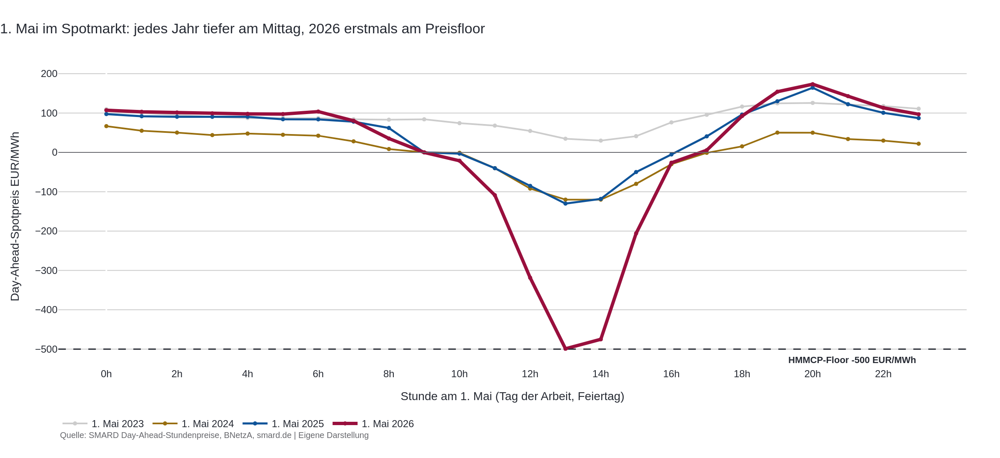
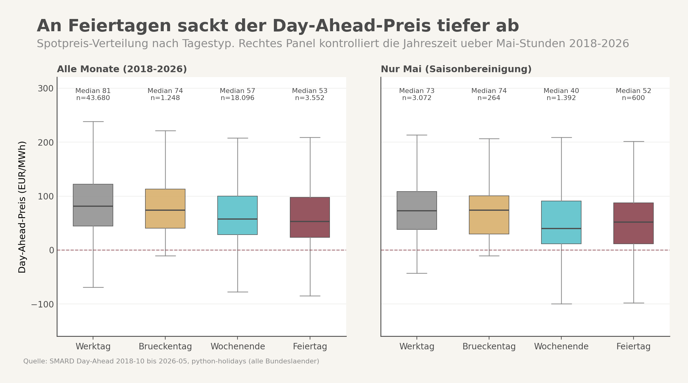
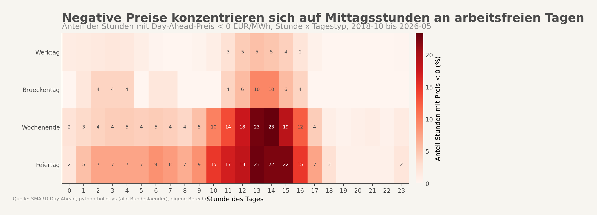
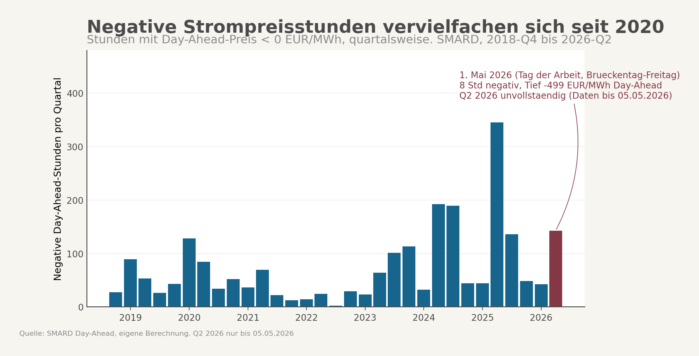
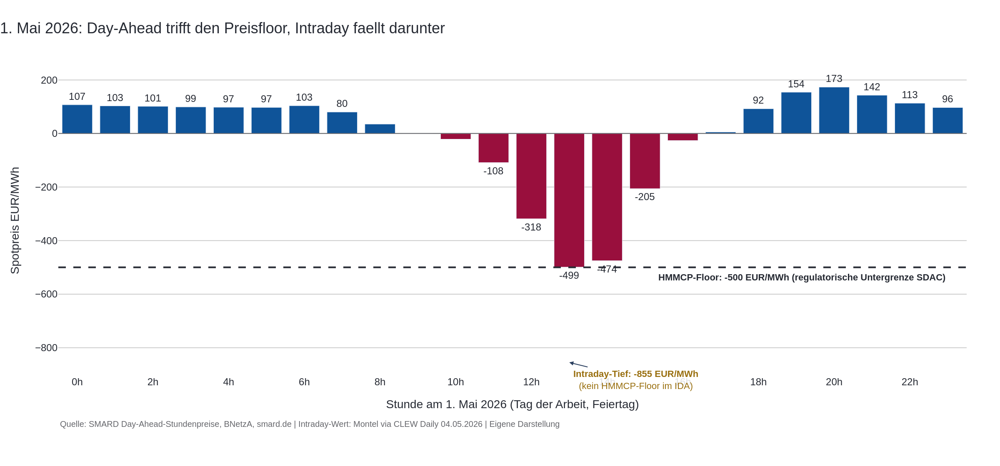

## Auslöser

Am 4. Mai 2026 zitiert der CLEW Daily eine Montel-Meldung mit einem Intraday-Tief von -855 EUR/MWh am 1. Mai 2026, dem ersten Maifeiertag. Stromauskunft.de bringt am gleichen Tag einen Mai-Wochenend-Bericht mit dem Titel "Strompreis-Paradox". Beide landen kurz nacheinander in der Inbox, beide framen den Tag als Wetter-Ereignis: viel Sonne, wenig Last, Markt versagt. Das ist die übliche Lesart. Sie übersieht, dass der 1. Mai nicht zufällig auf einen Freitag fiel, sondern als europaweiter Feiertag jedes Jahr Pflichttermin im Negativ-Preis-Kalender ist. Der Trichter-Effekt ist im Vier-Jahres-Vergleich deutlich sichtbar: 2023 lag der Mittagspreis am 1. Mai noch bei rund 90 EUR/MWh, 2024 bei null, 2025 bei minus 100, 2026 bei minus 499. Diese Beobachtung war der Anlass, acht Jahre Day-Ahead-Daten nach Tagestyp zu sortieren.



## Hauptbefund

An arbeitsfreien Tagen sind negative Day-Ahead-Stunden 6,2-mal wahrscheinlicher als an Werktagen. Über alle 66.456 Stunden seit Oktober 2018 gerechnet liegen Werktage bei 1,47 Prozent negativen Stunden, Brückentage bei 2,32 Prozent, Wochenenden bei 7,01 Prozent, Feiertage bei 9,04 Prozent. Die Hierarchie ist sauber, die Lücke zwischen Werktag und Feiertag ist groß genug, um aus Wetterzufall einen kalendarischen Strukturfaktor zu machen.

Saisonbereinigung ändert daran nichts. Wenn der Vergleich auf den Kalendermonat Mai eingeschränkt wird, also auf gleiche PV-Jahreszeit, bleibt der Effekt: Werktage 2,57 Prozent, Feiertage 13,33 Prozent. Faktor 5. Das bedeutet, der Kalender erklärt mehr als die Saison.

Der 1. Mai 2026 war kein Ausreißer, sondern der bisher tiefste Tag eines stetig wachsenden Trends. Day-Ahead-Tagestief um 13 Uhr: -499 EUR/MWh, acht aufeinanderfolgende Stunden negativ. Dieser Wert ist exakt einen Cent über dem regulatorischen Preisfloor der europäischen Strombörsenkopplung, dem HMMCP-Limit von -500 EUR/MWh. Der Markt wollte tiefer, durfte Day-Ahead aber nicht. Intraday, wo dieses Limit nicht gilt, fiel der Preis auf -855 EUR/MWh. Im Jahresvergleich: 2018 hatte rund 140 Negativstunden insgesamt, 2025 waren es 573. Eine Vervierfachung in sieben Jahren.





## Was der Mainstream-Frame verdeckt

Die übliche Erzählung lautet: Negativpreise sind ein Marktversagen. Zu viel Solar, zu wenig Speicher, der Markt produziert absurd tiefe Werte. Die Schuldzuweisungen verteilen sich je nach politischer Lesart auf "zu schnellen EE-Zubau", "fehlende Flexibilität" oder "Subventionsverzerrung". Was alle drei Frames teilen, ist die Annahme, das Phänomen sei wettergetrieben und damit stochastisch.

Diese Annahme verschleiert die strukturelle Komponente. Wenn Negativpreise primär aus Wetter entstünden, müssten sie sich gleichmäßig über alle Tage verteilen, an denen die meteorologischen Bedingungen passen. Tun sie nicht. Die Verteilung ist kalendarisch geclustert. PV-starke Werktage produzieren regelmäßig hohe Mittagseinspeisung, treffen aber auf Industrielast und Bürotage. PV-starke Feiertage treffen auf still gelegte Fabriken, leere Bürohäuser und ein Lastniveau, das an manchen Stunden auf Sommer-Sonntags-Niveau liegt. Dasselbe Wetter, halb so viel Verbrauch.

Die Pointe steckt in der Vorhersagbarkeit. Ein Werktag mit identischer PV-Erzeugung wie der 1. Mai 2026 hätte vermutlich einen einstelligen positiven Mittagspreis produziert. Der 1. Mai produzierte den HMMCP-Floor. Der Unterschied ist nicht Wetter, der Unterschied ist Lastkalender. Das Wetter ist die Verstärkung, der Kalender ist der Auslöser.



## Wo die eigentliche Diagnose liegt

Drei Befunde halten ökonomisch zusammen, und sie verändern die Diagnose der Reform-Debatte.

Erstens, die Tagestyp-Hierarchie ist stabil und vorhersagbar. Werktag, Brückentag, Wochenende, Feiertag in dieser Reihenfolge. Kein Tagestyp wechselt zwischen Hochpreis- und Negativpreis-Verhalten je nach Wetter, sondern jeder Tagestyp hat ein eigenes Risiko-Profil. Das ist ein Kalenderkreuz, kein Wetterwürfel.

Zweitens, der HMMCP-Floor von -500 EUR/MWh ist kein abstraktes Detail, sondern wird an extremen Feiertagen tatsächlich getroffen. Der historische Day-Ahead-Rekord stammt vom 2. Juli 2023 mit ebenfalls -500 EUR/MWh. Auch ein Sonntag, auch PV-starke Jahreszeit. Wenn ein regulatorisches Preislimit zur regelmäßigen Untergrenze wird, ist die Engpass-Lage strukturell, nicht episodisch. Der Markt zeigt zweifach an: Day-Ahead durch das Treffen des Limits, Intraday durch das Unterschreiten, sobald das Limit fehlt.



Drittens, die einzige sichtbare Marktantwort kommt von Großspeichern. Der BSW-Bericht für Q1 2026 nennt einen Speicherzubau von plus 67 Prozent gegenüber dem Vorjahr, getragen vor allem von Großbatterien (Vervierfachung). Solar-Neuanlagen gingen im selben Quartal um sechs Prozent zurück. Die Asymmetrie ist die Antwort: Wer Speicher baut, rechnet nicht mit mittlerem Spread, sondern mit Kalender-Spread. Der Erlös konzentriert sich auf wenige Tage in PV-starken Monaten, nicht gleichmäßig über das Jahr verteilt.

Diese drei Punkte zusammen verschieben die wirtschaftliche Lesart. Speicher-Wirtschaftlichkeitsrechnungen mit Mittelwert-Spreads unterschätzen das Erlöspotenzial systematisch, weil sie die Konzentration auf Feiertags-Cluster nicht abbilden. Umgekehrt überschätzen sie die Zuverlässigkeit, weil ein milder Mai ohne Pfingsten plus 1. Mai am Wochenende den Erlös für ein halbes Jahr verschiebt. Die richtige Modellierung ist Kalender-Risikomanagement, nicht stochastische Verteilung.

Politisch folgt daraus, dass die seit dem 25. Februar 2025 geltende verschärfte §51-EEG-Regelung, die Neuanlagen bereits bei der ersten negativen Viertelstunde aus der Förderung nimmt, an einer kalendarischen Realität ansetzt, nicht an einer zufälligen. Die Zahl der betroffenen Stunden ist planbar, nicht nur saisonal. Wer eine PV-Anlage 2026 baut, kann sich aus dem Kalender für die nächsten zehn Jahre ausrechnen, an wie vielen Stunden er voraussichtlich Förderung verliert.

## Internationaler Vergleich

Die Deep-Research-Recherche bestätigt den europäischen Kontext indirekt: Der 1. Mai ist als Tag der Arbeit nicht nur in Deutschland gesetzlicher Feiertag, sondern in fast allen kontinentaleuropäischen SDAC-Marktgebieten. Das verstärkt den Effekt durch die Kopplung. Wenn in Deutschland, Frankreich, Spanien, Italien und Polen gleichzeitig die Industrie ruht, fehlen über das ganze synchronisierte Marktgebiet Lastsenken. Die Marktkopplung kann den deutschen PV-Überschuss nicht in eine arbeitende Nachbarschaft exportieren, weil keine Nachbarschaft arbeitet.

Eine direkte Quantifizierung des UK- oder Spanien-Vergleichs liefert das vorliegende Material nicht in belastbarer Tiefe. Was die Recherche zeigt, ist die Symmetrie: Der HMMCP-Floor gilt für den gesamten SDAC-Markt, nicht nur für Deutschland. Wenn der Markt gegen den Floor läuft, läuft er es koppelweit. Das macht die Diagnose belastbarer: Es handelt sich nicht um ein deutsches Solarproblem, sondern um eine kontinentaleuropäische Kalender-Multiplikation, deren extremste Werte sich am stärksten in Marktgebieten mit hohem PV-Anteil zeigen.

## Was die Untersuchung gelernt hat

Die Hypothese ist im Kern bestätigt: Tagestyp ist ein eigener Erklärungsfaktor neben Saison und Wetter. Faktor 5 nach Saisonbereinigung ist deutlich zu groß, um Zufallsvariation zu sein.

Die Hypothese wurde an einer Stelle relativiert. Die ursprüngliche Formulierung "Negativpreise folgen dem Kalender, nicht dem Wetter" ist zu hart. Wetter ist nicht austauschbar mit Kalender, sondern Multiplikator. Ohne PV-starken Tag bleibt der Feiertag im positiven Bereich. Erst die Kombination aus Kalender-Niedriglast und Wetter-Hochangebot bringt den Floor in Reichweite. Die Formulierung wurde entsprechend angepasst.

Die Hypothese wurde an einer Stelle geschärft. Die ursprüngliche Faktor-21-Aussage zwischen 2018 und 2025 stammte aus einer fehlerhaften Baseline: Die SMARD-Daten der eigenen Auswertung beginnen erst im Oktober 2018, das Rumpfjahr ergab nur 27 Negativstunden. Externe Quellen zeigen für das Gesamtjahr 2018 rund 140 Stunden. Der echte Faktor zu 2025 ist damit etwa vier, nicht 21. Der Trend bleibt klar steigend, aber die Größenordnung ist deutlich kleiner. Diese Korrektur ist eine der wichtigsten Konsequenzen der Recherche.

## Grenzen

Day-Ahead vs. Intraday. Der mediale Rekord von -855 EUR/MWh stammt aus dem Intraday-Markt, der in der eigenen Datenbank nicht vorliegt. Day-Ahead-Werte sind konservativer. An extremen Tagen divergieren beide Märkte stark, weil der Intraday-Markt kurzfristige Engpässe abbildet, die Day-Ahead nicht mehr ausräumen kann. Die hier berechneten Verteilungen gelten für Day-Ahead und unterschätzen die Intraday-Tiefe.

Brückentag-Heuristik. Brückentage werden hier als Werktage definiert, die direkt an einen Feiertag oder ein Feiertag-Wochenend-Sandwich angrenzen, geprüft nur für Mo und Fr. Wer freitags nach Christi Himmelfahrt Brückenwoche nimmt, fällt in dieser Logik durchs Raster. Der wahre Verhaltens-Brückentag-Effekt ist eher unterschätzt.

Kein direkter PV- oder Wind-Kontroll. Die Saisonbereinigung über das Mai-Subsample kontrolliert die Jahreszeit, aber nicht die spezifische Erzeugungsstruktur eines einzelnen Tages. Stundengenaue Erneuerbaren-Daten würden den Kalender-Effekt vom Wetter-Effekt sauberer trennen. Diese Daten liegen nicht in der lokalen Datenbank und müssten separat geladen werden.

15-Minuten-Umstellung. Seit dem 30. Oktober 2025 läuft der SDAC auf 15-Minuten-Intervallen. Eine "Stunde" besteht seitdem aus vier Marktintervallen. Die Auswertung aggregiert weiterhin auf Stundenebene, weil SMARD die Daten konsistent so liefert. Direkte Vergleiche über die Umstellungsgrenze hinweg sind dadurch leicht unschärfer als innerhalb eines Aggregationsregimes.

Bundesländer-Vereinigung. Wenn ein Feiertag nur in einem oder zwei Bundesländern gilt, wird er trotzdem als Feiertag-Tag klassifiziert. Das verwässert den Effekt zugunsten der Werktag-Vergleichsgruppe und macht den gemessenen Faktor 6,2 eher zu einer Untergrenze als zur Spitze.

---

## Anhang A — Datenbasis und Vorgehen

Die Untersuchung stützt sich auf zwei Rohquellen plus eine externe Vergleichsstatistik. Erstens, die Day-Ahead-Stundenpreise des deutschen Spotmarkts, gezogen von SMARD, vom 1. Oktober 2018 bis zum 5. Mai 2026, insgesamt 66.456 Stunden. Zweitens, der Feiertagskalender für Deutschland 2018 bis 2026, dynamisch generiert über die python-holidays-Library in Version 0.95, mit der Vereinigung aller 16 Bundesländer als "Feiertag-irgendwo-in-DE"-Flag. Drittens, externe Jahressummen aus dem BNetzA-Monitoring und Branchenberichten (E&M, PV-Magazine, Enoplan, Solarserver) als unabhängige Vergleichszahlen für die Jahres-Trendlinie.

Aus diesen Quellen entstand zuerst eine Tagestyp-Klassifikation pro Datum: Werktag, Brückentag, Wochenende, Feiertag, in dieser Prioritätsreihenfolge. Brückentag wurde heuristisch als Werktag definiert, der unmittelbar an einen Feiertag oder ein Feiertag-Wochenend-Sandwich angrenzt. Die Klassifikation wurde mit den Day-Ahead-Stunden gejoint, sodass jede Stunde einen Tagestyp trägt.

Die Aggregation lief in drei Schritten. Zuerst der einfache Anteil negativer Stunden pro Tagestyp über alle Monate. Dann die saisonbereinigte Variante, die nur Stunden im Kalendermonat Mai berücksichtigt, um den Saison-Konfounder auszuschalten. Zuletzt die quartalsweise Trendlinie, um den Mehrjahres-Anstieg sichtbar zu machen, ergänzt um eine Stunden-Tagestyp-Heatmap zur Lokalisierung der Effekte auf die PV-Mittagsspitze.

Im Verlauf wurden zwei Korrekturen nötig. Erste Korrektur: die ursprüngliche 27-Stunden-Baseline für 2018 wurde durch den externen Wert von 140 Stunden ersetzt, weil die eigene Datenbank erst im Oktober 2018 beginnt und das Rumpfjahr nicht vergleichsfähig war. Zweite Korrektur: die Day-Ahead-Tiefstwerte wurden in den regulatorischen Kontext des HMMCP-Preisfloors gestellt, nachdem die Recherche zeigte, dass der Wert -499 EUR/MWh kein freies Marktergebnis ist, sondern den europäischen Day-Ahead-Mindestpreis spiegelt.

## Verformelung der Berechnung

Sei `P(t)` der Day-Ahead-Stundenpreis in EUR/MWh zur Stunde `t`. Sei `D(t)` der Kalendertag von `t` und `T(D)` der Tagestyp aus {Werktag, Brückentag, Wochenende, Feiertag}.

Anteil negativer Stunden je Tagestyp:

```text
share_neg(T) = |{t : P(t) < 0, T(D(t)) = T}|
              / |{t : T(D(t)) = T}|
```

Saisonbereinigter Anteil mit Monatsfilter `m`:

```text
share_neg(T | m) = |{t : P(t) < 0, T(D(t)) = T, month(t) = m}|
                  / |{t : T(D(t)) = T, month(t) = m}|
```

Tagestyp-Funktion `T(D)`:

```text
T(D) = Feiertag,    falls D in Holiday-Vereinigung
     = Wochenende,  falls weekday(D) in {Sa, So} und D nicht in Holiday-Vereinigung
     = Brückentag, falls weekday(D) Werktag
                    und ((D-1 in Holiday) oder (D+1 in Holiday)
                         oder (D-1 in {Sa,So} und D-2 in Holiday)
                         oder (D+1 in {Sa,So} und D+2 in Holiday))
     = Werktag,     sonst
```

Holiday-Vereinigung: Menge aller Tage `d`, für die mindestens ein Bundesland `B` aus den 16 deutschen Bundesländern existiert, sodass `d` gesetzlicher Feiertag in `B` ist.

Beispielrechnung Mai-Subsample:

```text
Werktag-Stunden im Mai (gesamt 2018-2026):           3.072
   davon negativ:                                       79
   share_neg(Werktag | Mai):                          2,57 %

Feiertag-Stunden im Mai (gesamt 2018-2026):            600
   davon negativ:                                       80
   share_neg(Feiertag | Mai):                        13,33 %

Faktor Mai-saisonbereinigt:                          5,19x
```

Beispielrechnung Trend-Vervierfachung:

```text
Negativstunden 2018 (Vollwert, externe Quelle E&M):   140
Negativstunden 2025 (eigene Auswertung,
                     extern bestätigt durch Enoplan): 573
Faktor 2018 -> 2025:                                 4,09x
```

Hinweis: Die eigene Datenbank zeigt für Q4 2018 nur 27 Stunden. Das ist kein Jahreswert, sondern das Rumpfjahr ab 1. Oktober 2018. Für Jahresvergleiche wird daher die externe BNetzA-Statistik verwendet.

## Quellen

- SMARD Day-Ahead-Stundenpreise, Bundesnetzagentur, 2018-10-01 bis 2026-05-05, https://www.smard.de/
- python-holidays Library, Version 0.95, https://github.com/vacanza/python-holidays
- E&M, "Strommarkt: 140 Stunden negative Strompreise in 2018", https://www.energie-und-management.de/nachrichten/detail/140-stunden-negative-strompreise-in-2018-129981
- Bundesnetzagentur via PV-Magazine, "457 Stunden mit negativen Strompreisen 2024", https://www.pv-magazine.de/2025/01/03/bundesnetzagentur-457-stunden-mit-negativen-strompreisen-insgesamt-weniger-preisspitzen-2024/
- Enoplan, "Strommarkt 2025: 573 Stunden mit Negativpreisen", https://www.enoplan.de/strommarkt-2025-573-stunden-mit-negativpreisen-flexibilität-lohnt-zunehmend/
- Solarserver, "Strommarkt 2025: Mehr Niedrigpreis- und Hochpreiszeiten", https://www.solarserver.de/2026/01/05/strommarkt-2025-mehr-niedrigpreis-und-hochpreiszeiten/
- Montel News, "German intraday power plunges to record low EUR -855/MWh", https://montelnews.com/news/fdbb6610-4474-43ca-b30f-7501dbdb4faf/german-intraday-power-plunges-to-record-low-eur-855-mwh
- ACER, "NEMOs proposal HMMCP SDAC Annex I in track changes", https://www.acer.europa.eu/sites/default/files/documents/Media/News/Documents/NEMOs-amendment-proposal-HMMCP-SDAC-Annex-I-TC-2025.pdf
- EPEX Spot, "Market Coupling Steering Committee confirms go-live of 15-minute MTU SDAC", https://www.epexspot.com/en/news/market-coupling-steering-committee-confirms-go-live-15-minute-mtu-sdac-trading-day-30
- Clearingstelle EEG/KWKG, "Zukunft der Vergütung: Negative Strompreise und Direktvermarktung" (BNetzA-Präsentation §51), https://www.clearingstelle-eeg-kwkg.de/sites/default/files/2025-07/0005_BNetzA_Boehm.pdf
- FfE, "Deutsche Strompreise an der Börse EPEX Spot im Jahr 2023", https://www.ffe.de/veröffentlichungen/deutsche-strompreise-an-der-börse-epex-spot-im-jahr-2023/
- Stromauskunft.de, "Negative Strompreise: Mai-Wochenende zeigt das Strompreis-Paradox", 04.05.2026, https://www.stromauskunft.de/strompreise/negative-strompreise/
- CLEW Daily, 04.05.2026, "Germany's solar installations drop while new battery storage hits record" (Inbox-Note [2026-05-04_Germanys solar installations drop while new batter](../germanys-solar-installations-drop-while-new-batter/))
- Eigene Auswertung [2026-05-04_negativpreise-feiertagsystematik](../negativpreise-feiertagsystematik/), Hypothese [2026-05-04_negativpreise-feiertagsystematik-mai-2026](../negativpreise-feiertagsystematik-mai-2026/), Vorlauf [2026-05-01_negativpreise-flexibilitätslücke](../negativpreise-flexibilit-tsl-cke/), Concept [kosten-der-energiewende](../kosten-der-energiewende/)
- Charts: `Analyses/assets/negativpreise_tagestyp_boxplot.png`, `Analyses/assets/negativpreise_quartal_zeitreihe.png`, `Analyses/assets/negativpreise_heatmap_stunde.png`
