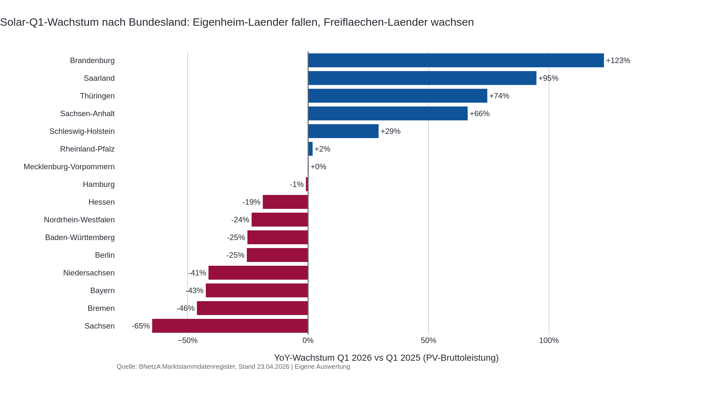
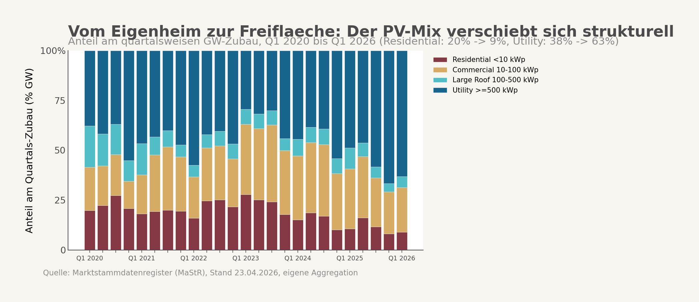
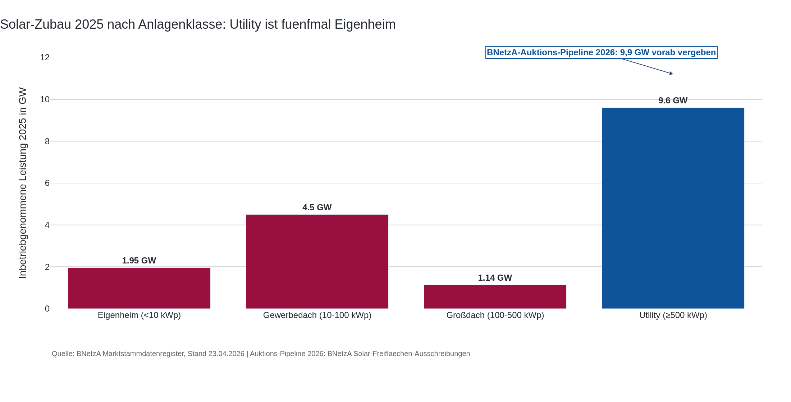
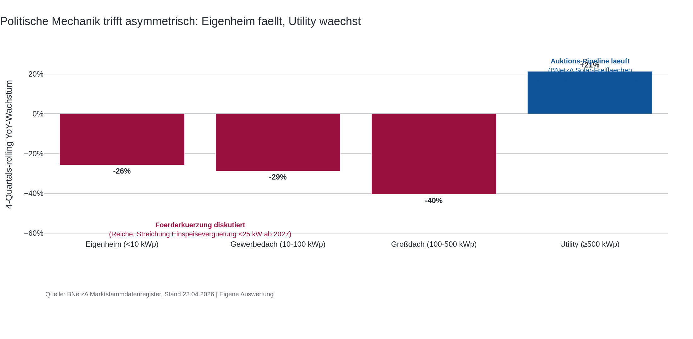
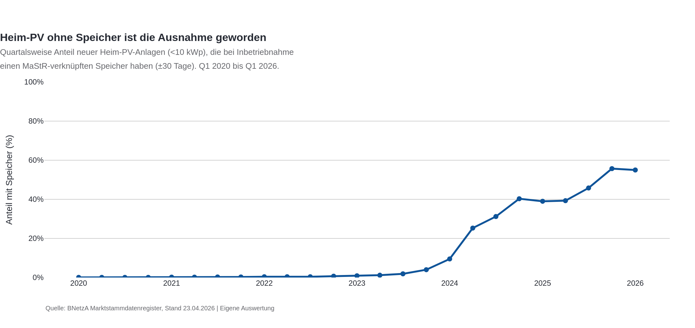

## Auslöser

Clean Energy Wire meldet am 4. Mai 2026 in seinem Daily-Newsletter einen außergewöhnlichen Befund: Der deutsche Solarzubau ist im ersten Quartal 2026 gegenüber dem Vorjahr um sechs Prozent gefallen, während Batteriespeicher um 67 Prozent zulegten und einen Rekord erreichten. Hinter dem Netto-Minus liegt die spannendere Geschichte. Der Bundesverband Solarwirtschaft beziffert in seiner Q1-Pressemitteilung den Rückgang im Eigenheim-Segment auf 21 Prozent, bei Gewerbedächern auf 33 Prozent, während Freiflächen um 20 Prozent gewachsen sind. BSW-Geschäftsführer Carsten Körnig warnt in der Mitteilung, ein temporärer Solar-Boom ersetze keine verlässlichen Investitionsbedingungen. Parallel kündigt Wirtschaftsministerin Katherina Reiche an, die Einspeisevergütung für Anlagen unter 25 Kilowatt ab 2027 zu streichen.

Die Schlagzeile war "Solar bricht ein, Speicher boomen". Die spannendere Frage liegt darunter. Wenn ein Drittel der Gewerbedächer wegbricht, aber Freiflächen waachsen, ist der Markt nicht insgesamt schwach, sondern strukturell auseinander gefallen. Der Anlass für diese Auswertung war damit nicht der Netto-Rückgang, sondern die Asymmetrie. Wer schrumpft, wer wächst, und wie weit ist die Schere wirklich offen.

## Hauptbefund

Die eigene Auswertung der amtlichen Anlagenregistrierungen über 25 Quartale ab Q1 2020 bestätigt das Muster und macht es scharf. Auf Basis der vier-Quartals-rollierenden Vorjahreswachstumsraten wachsen drei Segmente nicht mehr, eines wächst. Eigenheim-Anlagen unter zehn Kilowatt liegen im Q1 2026 bei minus 26 Prozent gegenüber Vorjahr. Gewerbedächer zwischen 10 und 100 Kilowatt bei minus 29 Prozent. Große Aufdach-Anlagen zwischen 100 und 500 Kilowatt bei minus 40 Prozent. Anlagen ab 500 Kilowatt, die Mehrzahl davon Freiflächen oder Industrie-Großdächer, wachsen mit plus 21 Prozent.

Was wirklich kippt, ist nicht das Niveau, sondern die Mischung. Im Q1 2020 stammten 20 Prozent der quartalsweise neu installierten Solarleistung aus dem Eigenheim-Segment. Im Q1 2026 sind es noch 9 Prozent. Der Anteil der Großanlagen über 500 Kilowatt ist im selben Zeitraum von 38 auf 63 Prozent gestiegen. Der Bürger-Anteil hat sich halbiert, der institutionelle Anteil ist zur dominanten Säule geworden.

Das ist kein Quartalsausreißer. Die Verschiebung läuft seit Mitte 2024 trendmäßig, beschleunigt sich in Q1 2026 und passt zur amtlichen Beobachtung der Bundesnetzagentur, dass das Verhältnis zwischen Gebäude- und Freiflächen-Installationen schon im Gesamtjahr 2025 von etwa zwei zu eins auf rund 50 zu 50 gekippt ist.

Sie verläuft auch regional auseinander. Wo Eigenheim-Anlagen den Markt bestimmen, fällt der Q1-Zubau zweistellig: Sachsen minus 65 Prozent, Bayern minus 43 Prozent, Niedersachsen minus 41 Prozent. Wo Freiflächen-Auktionen abgewickelt werden, wächst er ähnlich stark: Brandenburg plus 123 Prozent, Saarland plus 95 Prozent, Thüringen plus 74 Prozent. Dieselbe politische Lage trifft die Bundesländer diametral, weil sie unterschiedliche Marktstrukturen haben.







## Was der Mainstream-Frame verdeckt

Die öffentliche Erzählung zur Förderkürzung ist eine Strompreis-Geschichte. Die Industrie braucht günstigeren Strom, also muss die Förderlast sinken, also kürzt das Wirtschaftsministerium bei der Einspeisevergütung. Das ist eine konsistente Logik, wenn man nur auf Strompreis-Effekte für Industrie schaut. Sie verfehlt das Marktergebnis im Eigenheim.

Die Eigenheim-Wirtschaftlichkeit hängt nicht an der Industrie-Strompreis-Logik. Sie hängt am Eigenverbrauch und an der Differenz zwischen vermiedenen Bezugskosten und Investitionsamortisation. Wenn der Haushaltsstrompreis sinkt, wie ihn der BDEW im April 2026 mit 37,0 Cent je Kilowattstunde gegenüber den höheren Vorjahreswerten beschreibt, schwächt das den Eigenverbrauchs-Case. Wenn parallel die Einspeisevergütung politisch in Frage gestellt wird, schwächt das die Restvergütung des nicht selbst genutzten Stroms. Beide Effekte wirken auf das gleiche Segment.

Großanlagen leben in einer anderen Logik. Sie verkaufen ihren Strom direkt am Markt, oft abgesichert über langfristige Stromabnahmeverträge oder über Ausschreibungs-Zuschläge der Bundesnetzagentur. Für 2026 hat die Bundesnetzagentur Solar-Freiflächen-Ausschreibungen mit einem Volumen von 9.900 Megawatt angesetzt. Das ist planmäßiger Zubau, der weitgehend unabhängig von der Einspeisevergütung für Kleine läuft. Das Wachstum bei Großanlagen ist damit zum Teil schlicht das Abarbeiten dieser Auktions-Pipeline und kein direkter Reflex auf Förderkürzungen im Kleinanlagen-Segment. Die Skala der Pipeline überragt das Eigenheim-Segment um Faktor fünf, das ist im Gesamtjahr 2025 schon ablesbar.



Was der Mainstream-Frame damit verfehlt: Die gleiche politische Entscheidung wirkt auf die beiden Marktteile asymmetrisch. Bei Eigenheim summieren sich Strompreis-Rückgang und Förderdebatte zu einem doppelten Schlag. Bei Großanlagen läuft das Auktions-System weiter, weil es vor Jahren ausgeschrieben wurde. Das ist kein Zufall, sondern das Ergebnis einer regulatorischen Architektur, in der das eine Segment kontinuierlich und das andere diskretionär gesteuert wird.



## Wo die eigentliche Diagnose liegt

Drei Mechaniken erklären das Bild zusammen, keiner allein.

Die erste ist die Förderkürzungs-Asymmetrie. Eigenheim-Anlagen brauchen die Einspeisevergütung als Restanker für den nicht selbst verbrauchten Strom. Wenn die Bundesregierung diese Vergütung für Anlagen unter 25 Kilowatt ab 2027 streichen will, wie es Reiche angekündigt hat und wie es Tagesschau, ZDFheute und Capital übereinstimmend wiedergeben, kippt der Restanker. Investitionsentscheidungen reagieren darauf nicht erst, wenn das Gesetz in Kraft tritt, sondern sobald die Debatte glaubwürdig wird. Der Zubau-Einbruch im Eigenheim läuft seit Mitte 2024, beschleunigt sich aber sichtbar in den Quartalen, in denen die Kürzungs-Debatte öffentlich wurde. Kausal beweisen lässt sich der Zusammenhang aus der vorliegenden Auswertung nicht. Die zeitliche Korrelation passt, die Mechanik passt, das ist eine starke Hypothese, kein bewiesener Effekt.

Die zweite ist die Auktions-Mechanik bei Großanlagen. Das Wachstum im Utility-Segment ist nicht das Spiegelbild des Eigenheim-Einbruchs, also nicht "Geld wandert von klein nach gross", sondern der weitgehend unabhängige Vollzug eines mehrjährigen Ausschreibungs-Pipelines. Die 9.900 Megawatt für 2026 wurden lange vor der Reiche-Debatte ausgeschrieben, die Projekte sind finanziert, die Genehmigungen laufen. Was wir im Q1 2026 sehen, ist die planmäßige Inbetriebnahme dieser Pipeline. Genau deshalb ist die Behauptung "Eigenheim fällt, weil Großanlage wächst" falsch. Die Großanlage wächst, weil Auktionen das Volumen vorab festgelegt haben.

Die dritte ist die Speicher-Bündel-Mechanik. Hier hat eine Folge-Auswertung den ursprünglichen Speicher-Confounder zerlegt. Auf der Branchenebene meldet BSW-Solar Q1 2026 einen Speicherzubau von plus 67 Prozent gegenüber Vorjahr, getrieben fast ausschließlich von Großbatterien ab zehn Megawatt. Auf der Heim-Ebene zeigt das Marktstammdatenregister ein anderes Bild. Heim-Speicher unter 30 Kilowatt fielen Q1 2025 zu Q1 2026 von rund 123.000 auf 109.000 Anlagen, also minus elf Prozent. Heim-PV fiel im gleichen Vergleich um neunundzwanzig Prozent. Beide Reihen bewegen sich nach unten, der Speicher fällt nur weniger steil.

Der Grund liegt in der Kopplung. 55 Prozent der neuen Heim-PV-Anlagen Q1 2026 wurden mit MaStR-verknüpftem Speicher gleichzeitig registriert. Q1 2024 waren es noch 9,5 Prozent, Q1 2025 schon 39 Prozent. Heim-PV ohne Speicher ist 2026 die Minderheit geworden. Wenn Heim-PV einbricht, bricht der zugehörige Bündel-Speicher mechanisch mit ein. Es gibt also keine "Asset-Verschiebung weg von PV hin zu Speicher" im Eigenheim-Segment. Es gibt eine Bündel-Bewegung, die als Ganzes nach unten geht. Eigenheim-Besitzer investieren in Q1 2026 nicht anders, sie investieren weniger, beides Mal.



Für die politische Diagnose hat das eine andere Pointe als ursprünglich vermutet. Der Bürger-Rückzug ist nicht ein Wechsel der Asset-Klasse, sondern eine Verkleinerung des gesamten Heim-Energiewende-Pakets. Förderkürzung im PV-Bereich trifft also nicht nur die Modul-Investition, sondern reduziert über die Bündel-Mechanik auch die zugehörige Speicher-Investition. Die Erzeugungs-Säule schwächt sich, die Heim-Speicher-Säule schwächt sich mit, nur langsamer. Die "Speicher-Säule wächst"-Erzählung gilt für Großbatterien, nicht für Heim.

Wer den Befund ernst nimmt, sieht damit etwas anderes als die Industrie-Strompreis-Geschichte. Er sieht eine regulatorisch erzeugte Asymmetrie, in der Förderkürzung das eine Segment trifft und Auktionen das andere puffern. Er sieht eine Bürger-Mittelschicht, die ihr Investitionsbudget umlenkt, weil sich die Wirtschaftlichkeitsrechnung verschiebt. Und er sieht institutionelles Kapital, das die Energiewende-Erzählung von der dezentralen Bürger-Beteiligung zur Großanlagen-Pipeline umschreibt, ohne dass diese Verschiebung jemand explizit beschlossen hätte.

## Internationaler Vergleich

Das vorliegende Recherche-Material liefert keine belastbaren Vergleichszahlen aus Frankreich, dem Vereinigten Königreich oder Italien zur Eigenheim-versus-Großanlagen-Verteilung in Q1 2026. Eine seriose Kontrastfolie lässt sich daraus nicht bauen. Die Sektion bleibt deshalb bewusst kurz: Die deutsche Beobachtung ist, dass Auktions-Systeme stabil liefern und Einspeisevergütungs-Systeme wackeln, sobald die politische Debatte wackelt. Ob das international mustertypisch ist, wäre eine eigene Auswertung wert und ist hier nicht Gegenstand.

## Was die Untersuchung gelernt hat

Drei Dinge haben sich im Verlauf der Auswertung verschoben.

Erstens, die Verschiebung ist älter als die Reiche-Ankündigung. Der erste Reflex, den Förderkürzungs-Effekt zu suchen, blendet aus, dass die Schere schon Mitte 2024 zu reissen begonnen hat. Die Hypothese musste damit von "Förderkürzung verursacht Einbruch" auf "Förderkürzung beschleunigt eine laufende Verschiebung" geschärft werden.

Zweitens, der gesunkene Haushaltsstrompreis ist nicht Hintergrund-Kosmetik, sondern ein eigener Erklärungsbeitrag. Die ursprüngliche Formulierung "gleicher Strompreis, gleiche Zinsen" lässt sich nicht halten. Der BDEW-Datenpunkt von 37,0 Cent ist gegenüber den Vorjahreshöchstwerten ein Rückgang. Das schwächt den Eigenverbrauchs-Case und stützt die Energiepreis-Hypothese als Erklärungskonkurrent zur Förderpolitik. Beide wirken in dieselbe Richtung, was die Trennung der Effekte methodisch schwierig macht.

Drittens, der Speicher-Boom war im ursprünglichen Frame als möglicher Gegenbefund vermutet und durch eine Folge-Auswertung dann zerlegt. Die Branchen-Pressemitteilung ist GWh-zentriert und stark von Großbatterien getrieben. Auf Heim-Ebene zeigt das Marktstammdatenregister, dass Speicher und PV gemeinsam nach unten gehen, weil 55 Prozent der neuen Heim-PV mit Speicher gebündelt registriert werden. Damit verschwindet das ursprüngliche Bild "Bürger investiert in Speicher statt in PV". Heim-PV und Heim-Speicher sind ein gemeinsames Investitionspaket geworden und schrumpfen gemeinsam.

Die Hypothese steht damit auf "in Arbeit, richtungsweise gestützt". Die strukturelle Beobachtung ist robust. Die kausale Trennung zwischen Förderpolitik, Strompreis und Marktsättigung steht aus.

## Grenzen

Vier Vorbehalte gehören explizit dazu.

Kausalität ist nicht bewiesen. Die zeitliche Korrelation zwischen Reiche-Debatte und beschleunigtem Eigenheim-Rückgang ist deutlich, aber Zinsen, Strompreis-Erwartung und Marktsättigung sind als Kontrollvariablen nicht eingebaut. Eine sauberere Identifikation bräuchte ein Diff-in-Diff-Design mit einem unbetroffenen Kontroll-Segment, etwa Heim-Speicher unter anderem Förderregime, oder einen Vergleich mit Nachbarländern.

Meldeverzug verzerrt das Q1-Bild. Das Marktstammdatenregister registriert mit Verzögerung. Der Datenstand 23. April 2026 unterschätzt das endgültige Q1-Volumen typischerweise um 5 bis 15 Prozent. Die Bundesnetzagentur selbst rechnet für März 2026 mit einem Aufschlag von rund 15 Prozent für Nachmeldungen. Der Eigenheim-Einbruch kann sich damit nach Endmeldung etwas abschwächen, die Richtung bleibt aber sehr wahrscheinlich erhalten.

Repowering-Zählweisen unterscheiden sich. Die eigene Auswertung zählt jede neue Inbetriebnahme als Zubau, der Bundesverband Solarwirtschaft zählt teilweise nur die Differenzleistung. Das erklärt, warum die eigenen Werte beim Utility-Segment auf plus fünf Prozent liegen, während BSW plus 20 Prozent meldet. Beide Werte beschreiben die gleiche Richtung mit unterschiedlichem Vergrößerungsglas.

Die Segment-Definition über Kilowatt-Bins ist eine Abkürzung. Der Bundesverband Solarwirtschaft definiert das Heimsegment über alle Anlagen unter 30 Kilowatt, die eigene Auswertung benutzt 10 Kilowatt als obere Grenze. Viele moderne Einfamilienhaus-Anlagen liegen heute zwischen 10 und 15 Kilowatt und fallen damit in der eigenen Klassifikation in das Gewerbe-Segment. Die qualitative Aussage bleibt davon unberührt, die Absolutwerte sind aber nicht eins zu eins mit BSW-Zahlen vergleichbar. Zusätzlich ist das Lage-Feld im Marktstammdatenregister für 2025/2026-Q1-Records leer, sodass die Klasse "über 500 Kilowatt" Industrie-Großdächer und echte Freiflächen mischt.

---

## Anhang A — Datenbasis und Vorgehen

Die Auswertung beruht auf drei Bausteinen.

Der erste ist das amtliche Anlagenregister der Bundesnetzagentur, gezogen mit Datenstand 23. April 2026, mit Fokus auf alle gemeldeten Photovoltaik-Einheiten und ihrer installierten Bruttoleistung in Kilowatt. Endgültig stillgelegte Anlagen wurden ausgeschlossen. Der Zeitraum ist Q1 2020 bis Q1 2026, das ergibt 25 Quartale, die über das Inbetriebnahmedatum quartalsweise gebuckelt werden.

Der zweite Baustein ist die Q1-2026-Pressemitteilung des Bundesverbands Solarwirtschaft. Sie liefert die offizielle Verbands-Lesart der Segment-Zahlen, gegen die die eigene Aggregation plausibilisiert wird. Der Vergleich zeigt richtungsweise Übereinstimmung mit erklärbaren Niveau-Abweichungen aus Repowering-Zählweisen und Meldeverzug.

Der dritte Baustein ist der externe Recherche-Lauf, der die politische Einordnung absichert: die Reiche-Kürzungsankündigung über Tagesschau, ZDFheute und Capital, die BNetzA-Pressemitteilung zum Ausbau Erneuerbarer 2025 mit der 50:50-Beobachtung, das BNetzA-Ausschreibungsvolumen 2026 von 9.900 Megawatt, der BDEW-Haushaltsstrompreis von 37,0 Cent je Kilowattstunde im April 2026 und der solarserver-Bericht zum gleichzeitigen Batteriespeicher-Rekord.

Die Segment-Zuordnung erfolgt über Bruttoleistungs-Bins, weil das Lage-Feld (Aufdach versus Freifläche) für die jüngsten Quartale durchgängig leer ist. Vier Klassen: unter 10 Kilowatt für Eigenheim, 10 bis unter 100 Kilowatt für kleines Gewerbe, 100 bis unter 500 Kilowatt für große Aufdach-Anlagen, ab 500 Kilowatt für Großanlagen einschliesslich Industrie-Großdächer und Freiflächen. Die Caveats dieser Approximation sind im Grenzen-Kapitel oben dokumentiert.

Die Charts entstehen aus dieser Aggregation und zeigen erstens die rollierende Vorjahreswachstumsrate je Segment über 25 Quartale und zweitens die quartalsweise Mischung der Segmente am Gesamt-Zubau als gestapelter Balken.

## Verformelung der Berechnung

```text
Quartalsbucket:
quarter_q = date_trunc(Inbetriebnahmedatum, Quartal)

Segment-Bins über Bruttoleistung in Kilowatt:
Eigenheim    = Bruttoleistung   <  10 kWp
Gewerbe      = 10  <= Bruttoleistung < 100 kWp
Großdach    = 100 <= Bruttoleistung < 500 kWp
Großanlage  = Bruttoleistung   >= 500 kWp

Quartalszubau pro Segment in Gigawatt:
gw_q_seg = SUM(Bruttoleistung_kWp / 1.000.000)
           where Bruttoleistung in segment_bin
           and DatumEndgueltigeStilllegung IS NULL
           and quarter = q

Vier-Quartals-rollierende Summe:
rolling_q_seg = SUM(gw_q_seg) über {q-3, q-2, q-1, q}

Vier-Quartals-rollierendes Vorjahreswachstum:
yoy_rolling_q_seg = (rolling_q_seg / rolling_(q-4)_seg) - 1

Mix-Anteil pro Quartal:
share_q_seg = gw_q_seg / SUM_seg(gw_q_seg)
```

Beispielrechnung Q1 2026 für das Eigenheim-Segment: rollierende Summe der vier Quartale Q2 2025 bis Q1 2026 dividiert durch rollierende Summe Q2 2024 bis Q1 2025 minus eins ergibt minus 26 Prozent. Für Großanlagen ergibt die gleiche Rechnung plus 21 Prozent. Mix-Anteile: Eigenheim 9 Prozent in Q1 2026 gegenüber 20 Prozent in Q1 2020, Großanlagen 63 Prozent gegenüber 38 Prozent.

## Quellen

1. Bundesverband Solarwirtschaft, Pressemitteilung Q1 2026 zu PV-Zubau und Marktbericht, bsw-solar.de, 2026.
2. Clean Energy Wire, Daily Newsletter "Germany's solar installations drop while new battery storage hits record", cleanenergywire.org, 2026-05-04.
3. Bundesnetzagentur, Marktstammdatenregister, Datenstand 23.04.2026, eigene Auswertung der PV-Einheiten nach Bruttoleistungs-Klasse und Quartal, marktstammdatenregister.de.
4. Bundesnetzagentur, Pressemitteilung "Ausbau Erneuerbarer Energien 2025", bundesnetzagentur.de, 2026-01-08.
5. Bundesnetzagentur, "Ausschreibung Solaranlagen erstes Segment, Gebotstermin 1. März 2026", bundesnetzagentur.de.
6. tagesschau.de, "Reiche stellt Förderung privater Solaranlagen infrage", 2026.
7. ZDFheute, "Solar-Einspeisevergütung: Stimmen zu Katherina Reiches Plänen", 2026.
8. Capital.de, "Solaranlagen Förderung 2026: Reiche hat mit Zuschuss-Stopp recht", 2026.
9. BDEW, Strompreisanalyse April 2026, bdew.de.
10. solarserver.de, "Q1/26: Photovoltaik-Ausbau lahmt, Batteriespeicher boomen", 2026-05-04.
11. pv-magazine.de, "Bundesnetzagentur erwartet 1411 Megawatt Photovoltaik-Zubau im März", 2026-04-15.
12. Energy-Charts, durchschnittliche Börsenstrompreise, energy-charts.info.
