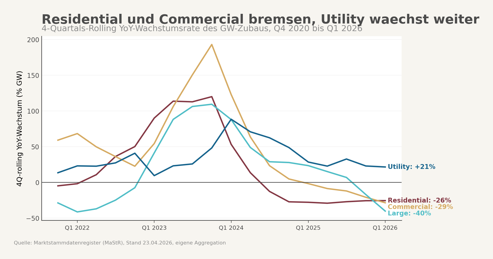

## Auslöser

Clean Energy Wire meldet am 4. Mai 2026 in seinem Daily-Newsletter einen aussergewoehnlichen Befund: Der deutsche Solarzubau ist im ersten Quartal 2026 gegenueber dem Vorjahr um sechs Prozent gefallen, waehrend Batteriespeicher um 67 Prozent zulegten und einen Rekord erreichten. Hinter dem Netto-Minus liegt die spannendere Geschichte. Der Bundesverband Solarwirtschaft beziffert in seiner Q1-Pressemitteilung den Rueckgang im Eigenheim-Segment auf 21 Prozent, bei Gewerbedaechern auf 33 Prozent, waehrend Freiflaechen um 20 Prozent gewachsen sind. BSW-Geschaeftsfuehrer Carsten Koernig warnt in der Mitteilung, ein temporaerer Solar-Boom ersetze keine verlaesslichen Investitionsbedingungen. Parallel kuendigt Wirtschaftsministerin Katherina Reiche an, die Einspeiseverguetung fuer Anlagen unter 25 Kilowatt ab 2027 zu streichen.

Die Schlagzeile war "Solar bricht ein, Speicher boomen". Die spannendere Frage liegt darunter. Wenn ein Drittel der Gewerbedaecher wegbricht, aber Freiflaechen waachsen, ist der Markt nicht insgesamt schwach, sondern strukturell auseinander gefallen. Der Anlass fuer diese Auswertung war damit nicht der Netto-Rueckgang, sondern die Asymmetrie. Wer schrumpft, wer waechst, und wie weit ist die Schere wirklich offen.

## Hauptbefund

Die eigene Auswertung der amtlichen Anlagenregistrierungen ueber 25 Quartale ab Q1 2020 bestaetigt das Muster und macht es scharf. Auf Basis der vier-Quartals-rollierenden Vorjahreswachstumsraten wachsen drei Segmente nicht mehr, eines waechst. Eigenheim-Anlagen unter zehn Kilowatt liegen im Q1 2026 bei minus 26 Prozent gegenueber Vorjahr. Gewerbedaecher zwischen 10 und 100 Kilowatt bei minus 29 Prozent. Grosse Aufdach-Anlagen zwischen 100 und 500 Kilowatt bei minus 40 Prozent. Anlagen ab 500 Kilowatt, die Mehrzahl davon Freiflaechen oder Industrie-Grossdaecher, wachsen mit plus 21 Prozent.

Was wirklich kippt, ist nicht das Niveau, sondern die Mischung. Im Q1 2020 stammten 20 Prozent der quartalsweise neu installierten Solarleistung aus dem Eigenheim-Segment. Im Q1 2026 sind es noch 9 Prozent. Der Anteil der Grossanlagen ueber 500 Kilowatt ist im selben Zeitraum von 38 auf 63 Prozent gestiegen. Der Buerger-Anteil hat sich halbiert, der institutionelle Anteil ist zur dominanten Saeule geworden.

Das ist kein Quartalsausreisser. Die Verschiebung laeuft seit Mitte 2024 trendmaessig, beschleunigt sich in Q1 2026 und passt zur amtlichen Beobachtung der Bundesnetzagentur, dass das Verhaeltnis zwischen Gebaeude- und Freiflaechen-Installationen schon im Gesamtjahr 2025 von etwa zwei zu eins auf rund 50 zu 50 gekippt ist.




## Was der Mainstream-Frame verdeckt

Die oeffentliche Erzaehlung zur Foerderkuerzung ist eine Strompreis-Geschichte. Die Industrie braucht guenstigeren Strom, also muss die Foerderlast sinken, also kuerzt das Wirtschaftsministerium bei der Einspeiseverguetung. Das ist eine konsistente Logik, wenn man nur auf Strompreis-Effekte fuer Industrie schaut. Sie verfehlt das Marktergebnis im Eigenheim.

Die Eigenheim-Wirtschaftlichkeit haengt nicht an der Industrie-Strompreis-Logik. Sie haengt am Eigenverbrauch und an der Differenz zwischen vermiedenen Bezugskosten und Investitionsamortisation. Wenn der Haushaltsstrompreis sinkt, wie ihn der BDEW im April 2026 mit 37,0 Cent je Kilowattstunde gegenueber den hoehren Vorjahreswerten beschreibt, schwaecht das den Eigenverbrauchs-Case. Wenn parallel die Einspeiseverguetung politisch in Frage gestellt wird, schwaecht das die Restvergueterung des nicht selbst genutzten Stroms. Beide Effekte wirken auf das gleiche Segment.

Grossanlagen leben in einer anderen Logik. Sie verkaufen ihren Strom direkt am Markt, oft abgesichert ueber langfristige Stromabnahmevertraege oder ueber Ausschreibungs-Zuschlaege der Bundesnetzagentur. Fuer 2026 hat die Bundesnetzagentur Solar-Freiflaechen-Ausschreibungen mit einem Volumen von 9.900 Megawatt angesetzt. Das ist planmaessiger Zubau, der weitgehend unabhaengig von der Einspeiseverguetung fuer Kleine laeuft. Das Wachstum bei Grossanlagen ist damit zum Teil schlicht das Abarbeiten dieser Auktions-Pipeline und kein direkter Reflex auf Foerderkuerzungen im Kleinanlagen-Segment.

Was der Mainstream-Frame damit verfehlt: Die gleiche politische Entscheidung wirkt auf die beiden Marktteile asymmetrisch. Bei Eigenheim summieren sich Strompreis-Rueckgang und Foerderdebatte zu einem doppelten Schlag. Bei Grossanlagen laeuft das Auktions-System weiter, weil es vor Jahren ausgeschrieben wurde. Das ist kein Zufall, sondern das Ergebnis einer regulatorischen Architektur, in der das eine Segment kontinuierlich und das andere diskretionaer gesteuert wird.

## Wo die eigentliche Diagnose liegt

Drei Mechaniken erklaeren das Bild zusammen, keiner allein.

Die erste ist die Foerderkuerzungs-Asymmetrie. Eigenheim-Anlagen brauchen die Einspeiseverguetung als Restanker fuer den nicht selbst verbrauchten Strom. Wenn die Bundesregierung diese Verguetung fuer Anlagen unter 25 Kilowatt ab 2027 streichen will, wie es Reiche angekuendigt hat und wie es Tagesschau, ZDFheute und Capital uebereinstimmend wiedergeben, kippt der Restanker. Investitionsentscheidungen reagieren darauf nicht erst, wenn das Gesetz in Kraft tritt, sondern sobald die Debatte glaubwuerdig wird. Der Zubau-Einbruch im Eigenheim laeuft seit Mitte 2024, beschleunigt sich aber sichtbar in den Quartalen, in denen die Kuerzungs-Debatte oeffentlich wurde. Kausal beweisen laesst sich der Zusammenhang aus der vorliegenden Auswertung nicht. Die zeitliche Korrelation passt, die Mechanik passt, das ist eine starke Hypothese, kein bewiesener Effekt.

Die zweite ist die Auktions-Mechanik bei Grossanlagen. Das Wachstum im Utility-Segment ist nicht das Spiegelbild des Eigenheim-Einbruchs, also nicht "Geld wandert von klein nach gross", sondern der weitgehend unabhaengige Vollzug eines mehrjaehrigen Ausschreibungs-Pipelines. Die 9.900 Megawatt fuer 2026 wurden lange vor der Reiche-Debatte ausgeschrieben, die Projekte sind finanziert, die Genehmigungen laufen. Was wir im Q1 2026 sehen, ist die planmaessige Inbetriebnahme dieser Pipeline. Genau deshalb ist die Behauptung "Eigenheim faellt, weil Grossanlage waechst" falsch. Die Grossanlage waechst, weil Auktionen das Volumen vorab festgelegt haben.

Die dritte ist der Speicher-Confounder. Im selben Quartal, in dem der PV-Zubau um sechs Prozent faellt, legt der Batteriespeicher-Zubau um 67 Prozent zu. BSW-Solar berichtet von rund zwei Gigawattstunden neu installierter Speicherkapazitaet zwischen Januar und Maerz und einem Gesamtbestand von etwa 28 Gigawattstunden ueber 2,5 Millionen Anlagen. Eigenheim-Besitzer investieren also nicht weniger, sie investieren anders. Sie verschieben Budget von Modulen zu Speichern. Das macht den Eigenheim-Einbruch zum Teil zu einer Asset-Verschiebung innerhalb des gleichen Haushalts und nicht zu einem reinen Rueckzug aus der Energiewende-Investition. Fuer die politische Diagnose ist das wichtig: Der Buerger zieht sich nicht aus dem Strommarkt zurueck, er optimiert sein Eigenverbrauchs-Profil ohne neue Erzeugung. Die Erzeugungs-Saeule schwaecht sich, die Speicher-Saeule waechst.

Wer den Befund ernst nimmt, sieht damit etwas anderes als die Industrie-Strompreis-Geschichte. Er sieht eine regulatorisch erzeugte Asymmetrie, in der Foerderkuerzung das eine Segment trifft und Auktionen das andere puffern. Er sieht eine Buerger-Mittelschicht, die ihr Investitionsbudget umlenkt, weil sich die Wirtschaftlichkeitsrechnung verschiebt. Und er sieht institutionelles Kapital, das die Energiewende-Erzaehlung von der dezentralen Buerger-Beteiligung zur Grossanlagen-Pipeline umschreibt, ohne dass diese Verschiebung jemand explizit beschlossen haette.

## Internationaler Vergleich

Das vorliegende Recherche-Material liefert keine belastbaren Vergleichszahlen aus Frankreich, dem Vereinigten Koenigreich oder Italien zur Eigenheim-versus-Grossanlagen-Verteilung in Q1 2026. Eine seriose Kontrastfolie laesst sich daraus nicht bauen. Die Sektion bleibt deshalb bewusst kurz: Die deutsche Beobachtung ist, dass Auktions-Systeme stabil liefern und Einspeiseverguetungs-Systeme wackeln, sobald die politische Debatte wackelt. Ob das international mustertypisch ist, waere eine eigene Auswertung wert und ist hier nicht Gegenstand.

## Was die Untersuchung gelernt hat

Drei Dinge haben sich im Verlauf der Auswertung verschoben.

Erstens, die Verschiebung ist aelter als die Reiche-Ankuendigung. Der erste Reflex, den Foerderkuerzungs-Effekt zu suchen, blendet aus, dass die Schere schon Mitte 2024 zu reissen begonnen hat. Die Hypothese musste damit von "Foerderkuerzung verursacht Einbruch" auf "Foerderkuerzung beschleunigt eine laufende Verschiebung" geschaerft werden.

Zweitens, der gesunkene Haushaltsstrompreis ist nicht Hintergrund-Kosmetik, sondern ein eigener Erklaerungsbeitrag. Die urspruengliche Formulierung "gleicher Strompreis, gleiche Zinsen" laesst sich nicht halten. Der BDEW-Datenpunkt von 37,0 Cent ist gegenueber den Vorjahreshoechstwerten ein Rueckgang. Das schwaecht den Eigenverbrauchs-Case und stuetzt die Energiepreis-Hypothese als Erklaerungskonkurrent zur Foerderpolitik. Beide wirken in dieselbe Richtung, was die Trennung der Effekte methodisch schwierig macht.

Drittens, der Speicher-Boom war im urspruenglichen Frame nicht enthalten und musste nachgetragen werden. Ohne den Speicher-Confounder wirkt der Eigenheim-Rueckzug dramatischer als er ist. Mit ihm wird klar, dass die Investitionsbereitschaft im Haushaltsbereich existiert, nur eben in eine andere Asset-Klasse fliesst.

Die Hypothese steht damit auf "in Arbeit, richtungsweise gestuetzt". Die strukturelle Beobachtung ist robust. Die kausale Trennung zwischen Foerderpolitik, Strompreis und Marktsaettigung steht aus.

## Grenzen

Vier Vorbehalte gehoeren explizit dazu.

Kausalitaet ist nicht bewiesen. Die zeitliche Korrelation zwischen Reiche-Debatte und beschleunigtem Eigenheim-Rueckgang ist deutlich, aber Zinsen, Strompreis-Erwartung und Marktsaettigung sind als Kontrollvariablen nicht eingebaut. Eine sauberere Identifikation braeuchte ein Diff-in-Diff-Design mit einem unbetroffenen Kontroll-Segment, etwa Heim-Speicher unter anderem Foerderregime, oder einen Vergleich mit Nachbarlaendern.

Meldeverzug verzerrt das Q1-Bild. Das Marktstammdatenregister registriert mit Verzoegerung. Der Datenstand 23. April 2026 unterschaetzt das endgueltige Q1-Volumen typischerweise um 5 bis 15 Prozent. Die Bundesnetzagentur selbst rechnet fuer Maerz 2026 mit einem Aufschlag von rund 15 Prozent fuer Nachmeldungen. Der Eigenheim-Einbruch kann sich damit nach Endmeldung etwas abschwaechen, die Richtung bleibt aber sehr wahrscheinlich erhalten.

Repowering-Zaehlweisen unterscheiden sich. Die eigene Auswertung zaehlt jede neue Inbetriebnahme als Zubau, der Bundesverband Solarwirtschaft zaehlt teilweise nur die Differenzleistung. Das erklaert, warum die eigenen Werte beim Utility-Segment auf plus fuenf Prozent liegen, waehrend BSW plus 20 Prozent meldet. Beide Werte beschreiben die gleiche Richtung mit unterschiedlichem Vergroesserungsglas.

Die Segment-Definition ueber Kilowatt-Bins ist eine Abkuerzung. Der Bundesverband Solarwirtschaft definiert das Heimsegment ueber alle Anlagen unter 30 Kilowatt, die eigene Auswertung benutzt 10 Kilowatt als obere Grenze. Viele moderne Einfamilienhaus-Anlagen liegen heute zwischen 10 und 15 Kilowatt und fallen damit in der eigenen Klassifikation in das Gewerbe-Segment. Die qualitative Aussage bleibt davon unberuehrt, die Absolutwerte sind aber nicht eins zu eins mit BSW-Zahlen vergleichbar. Zusaetzlich ist das Lage-Feld im Marktstammdatenregister fuer 2025/2026-Q1-Records leer, sodass die Klasse "ueber 500 Kilowatt" Industrie-Grossdaecher und echte Freiflaechen mischt.

---

## Anhang A — Datenbasis und Vorgehen

Die Auswertung beruht auf drei Bausteinen.

Der erste ist das amtliche Anlagenregister der Bundesnetzagentur, gezogen mit Datenstand 23. April 2026, mit Fokus auf alle gemeldeten Photovoltaik-Einheiten und ihrer installierten Bruttoleistung in Kilowatt. Endgueltig stillgelegte Anlagen wurden ausgeschlossen. Der Zeitraum ist Q1 2020 bis Q1 2026, das ergibt 25 Quartale, die ueber das Inbetriebnahmedatum quartalsweise gebuckelt werden.

Der zweite Baustein ist die Q1-2026-Pressemitteilung des Bundesverbands Solarwirtschaft. Sie liefert die offizielle Verbands-Lesart der Segment-Zahlen, gegen die die eigene Aggregation plausibilisiert wird. Der Vergleich zeigt richtungsweise Uebereinstimmung mit erklaerbaren Niveau-Abweichungen aus Repowering-Zaehlweisen und Meldeverzug.

Der dritte Baustein ist der externe Recherche-Lauf, der die politische Einordnung absichert: die Reiche-Kuerzungsankuendigung ueber Tagesschau, ZDFheute und Capital, die BNetzA-Pressemitteilung zum Ausbau Erneuerbarer 2025 mit der 50:50-Beobachtung, das BNetzA-Ausschreibungsvolumen 2026 von 9.900 Megawatt, der BDEW-Haushaltsstrompreis von 37,0 Cent je Kilowattstunde im April 2026 und der solarserver-Bericht zum gleichzeitigen Batteriespeicher-Rekord.

Die Segment-Zuordnung erfolgt ueber Bruttoleistungs-Bins, weil das Lage-Feld (Aufdach versus Freiflaeche) fuer die juengsten Quartale durchgaengig leer ist. Vier Klassen: unter 10 Kilowatt fuer Eigenheim, 10 bis unter 100 Kilowatt fuer kleines Gewerbe, 100 bis unter 500 Kilowatt fuer grosse Aufdach-Anlagen, ab 500 Kilowatt fuer Grossanlagen einschliesslich Industrie-Grossdaecher und Freiflaechen. Die Caveats dieser Approximation sind im Grenzen-Kapitel oben dokumentiert.

Die Charts entstehen aus dieser Aggregation und zeigen erstens die rollierende Vorjahreswachstumsrate je Segment ueber 25 Quartale und zweitens die quartalsweise Mischung der Segmente am Gesamt-Zubau als gestapelter Balken.

## Verformelung der Berechnung

```text
Quartalsbucket:
quarter_q = date_trunc(Inbetriebnahmedatum, Quartal)

Segment-Bins ueber Bruttoleistung in Kilowatt:
Eigenheim    = Bruttoleistung   <  10 kWp
Gewerbe      = 10  <= Bruttoleistung < 100 kWp
Grossdach    = 100 <= Bruttoleistung < 500 kWp
Grossanlage  = Bruttoleistung   >= 500 kWp

Quartalszubau pro Segment in Gigawatt:
gw_q_seg = SUM(Bruttoleistung_kWp / 1.000.000)
           where Bruttoleistung in segment_bin
           and DatumEndgueltigeStilllegung IS NULL
           and quarter = q

Vier-Quartals-rollierende Summe:
rolling_q_seg = SUM(gw_q_seg) ueber {q-3, q-2, q-1, q}

Vier-Quartals-rollierendes Vorjahreswachstum:
yoy_rolling_q_seg = (rolling_q_seg / rolling_(q-4)_seg) - 1

Mix-Anteil pro Quartal:
share_q_seg = gw_q_seg / SUM_seg(gw_q_seg)
```

Beispielrechnung Q1 2026 fuer das Eigenheim-Segment: rollierende Summe der vier Quartale Q2 2025 bis Q1 2026 dividiert durch rollierende Summe Q2 2024 bis Q1 2025 minus eins ergibt minus 26 Prozent. Fuer Grossanlagen ergibt die gleiche Rechnung plus 21 Prozent. Mix-Anteile: Eigenheim 9 Prozent in Q1 2026 gegenueber 20 Prozent in Q1 2020, Grossanlagen 63 Prozent gegenueber 38 Prozent.

## Quellen

1. Bundesverband Solarwirtschaft, Pressemitteilung Q1 2026 zu PV-Zubau und Marktbericht, bsw-solar.de, 2026.
2. Clean Energy Wire, Daily Newsletter "Germany's solar installations drop while new battery storage hits record", cleanenergywire.org, 2026-05-04.
3. Bundesnetzagentur, Marktstammdatenregister, Datenstand 23.04.2026, eigene Auswertung der PV-Einheiten nach Bruttoleistungs-Klasse und Quartal, marktstammdatenregister.de.
4. Bundesnetzagentur, Pressemitteilung "Ausbau Erneuerbarer Energien 2025", bundesnetzagentur.de, 2026-01-08.
5. Bundesnetzagentur, "Ausschreibung Solaranlagen erstes Segment, Gebotstermin 1. Maerz 2026", bundesnetzagentur.de.
6. tagesschau.de, "Reiche stellt Foerderung privater Solaranlagen infrage", 2026.
7. ZDFheute, "Solar-Einspeiseverguetung: Stimmen zu Katherina Reiches Plaenen", 2026.
8. Capital.de, "Solaranlagen Foerderung 2026: Reiche hat mit Zuschuss-Stopp recht", 2026.
9. BDEW, Strompreisanalyse April 2026, bdew.de.
10. solarserver.de, "Q1/26: Photovoltaik-Ausbau lahmt, Batteriespeicher boomen", 2026-05-04.
11. pv-magazine.de, "Bundesnetzagentur erwartet 1411 Megawatt Photovoltaik-Zubau im Maerz", 2026-04-15.
12. Energy-Charts, durchschnittliche Boersenstrompreise, energy-charts.info.
