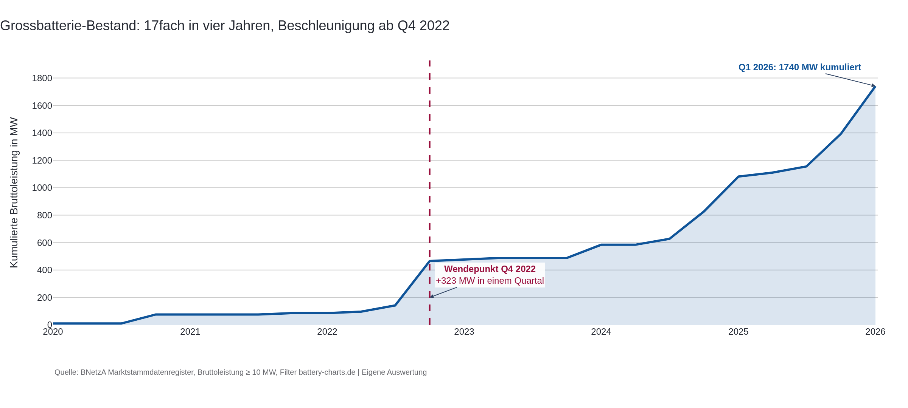
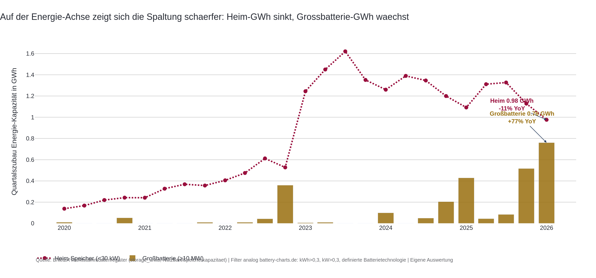
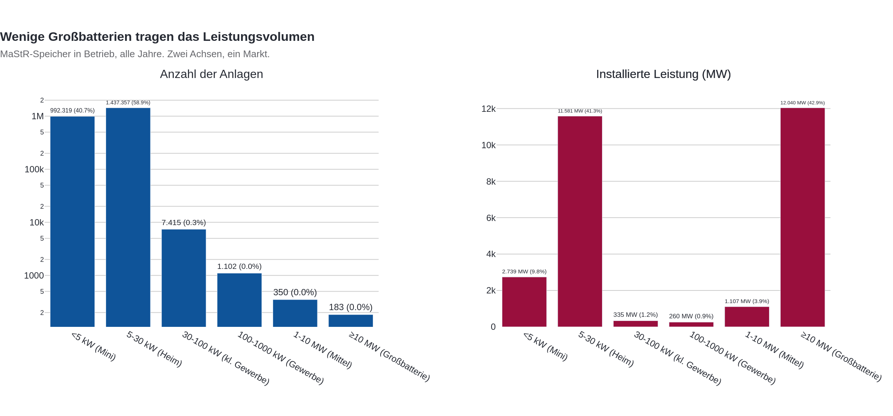
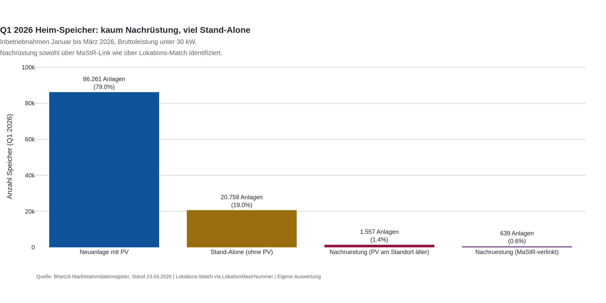
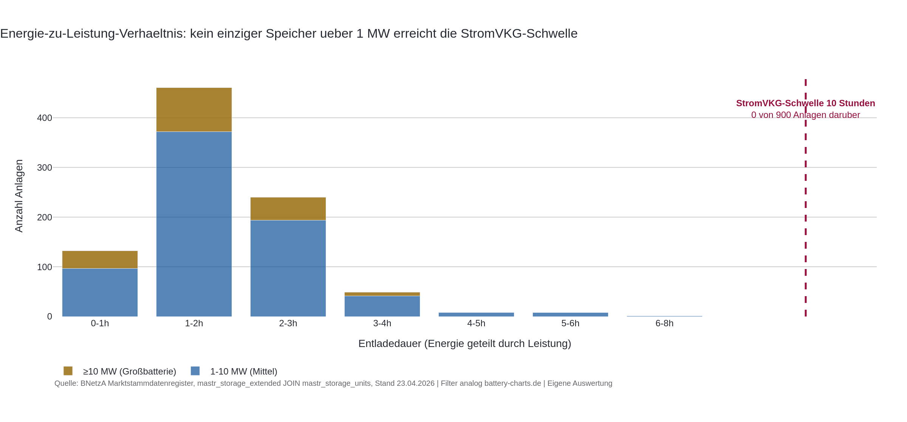

## Auslöser

Clean Energy Wire hat am 04.05.2026 in seiner Daily eine BSW-Solar-Auswertung der MaStR-Daten zitiert: PV-Zubau Q1 2026 minus 6 Prozent gegen Vorjahr, Batteriespeicher-Zubau plus 67 Prozent, Bestand jetzt 28 GWh über rund 2,5 Millionen Anlagen. Im selben Aufmacher fordert Carsten Körnig vom BSW, Batterien im geplanten Capacity-Market-Tender nicht zu diskriminieren. Zwei Tage zuvor hatte die Kanzlei Goerg den Referentenentwurf zum Stromversorgungs-Kapazitätsgesetz (StromVKG) durchgearbeitet und festgehalten, dass die geplante Auktion für Langzeitkapazitäten 10 Stunden Dauerleistung verlangt, eine Schwelle, die heutige Batteriespeicher faktisch ausschließt. Drei Signale am selben Tag, die scheinbar in dieselbe Richtung zeigen. Das hat mich in die MaStR-Rohdaten geschickt. Was dort steht, ist anders als die Schlagzeile.

## Hauptbefund

Der deutsche Speichermarkt zerfällt in zwei Welten, und sie folgen unterschiedlichen Logiken.

**Welt 1, Heim-Speicher: Bündel-Markt mit der PV gekoppelt.** Q1 2026 wurden 86.000 neue Heim-Speicher unter 30 Kilowatt registriert, davon 79 Prozent gleichzeitig mit einer PV-Anlage. Die Bundle-Quote, also der Anteil neuer Heim-PV-Anlagen mit gleichzeitig registriertem MaStR-verknüpftem Speicher, ist innerhalb von zwei Jahren von 9,5 Prozent (Q1 2024) auf 55 Prozent (Q1 2026) gesprungen. Heim-PV ohne Speicher ist 2026 die Minderheit geworden. Wenn Heim-PV einbricht, bricht Heim-Speicher mechanisch mit. Die Zahlen: Heim-Speicher Q1 2025 zu Q1 2026 minus 11 Prozent. Heim-PV im gleichen Vergleich minus 29 Prozent. Beide Reihen zeigen nach unten, der Speicher fällt nur weniger steil, weil ein wachsendes Stand-Alone-Segment einen Teil der PV-Bremse abfängt.

**Welt 2, Großbatterie: Stand-Alone-Markt mit eigener Wachstumskurve.** 183 Anlagen ab 10 Megawatt halten 43 Prozent der gesamten installierten Speicher-Leistung, obwohl sie nur 0,008 Prozent aller Anlagen sind. Davon hat keine einzige eine PV-Verknüpfung in MaStR. Q1 2020 bis Q1 2022 lag der Großbatterie-Quartalszubau bei null bis 80 MW. Seit Q4 2022 zieht er an, Q1 2025 bei 254 MW, Q1 2026 bei 347 MW. Auf der Energie-Achse ist die Beschleunigung noch deutlicher: Großbatterie-Quartalszubau Q1 2025 mit 0,43 GWh, Q1 2026 mit 0,76 GWh, also plus 77 Prozent gegenüber Vorjahr. Diese Welle hat mit dem Heim-Markt nichts zu tun. Sie wird von Spread-Erlösen, Frequenzregelung und perspektivisch Capacity-Market-Tender getrieben.





Die BSW-Schlagzeile "Speicher plus 67 Prozent" lässt sich gegen den MaStR-Cut prüfen. Eigene Aggregation Q1 2026 ergibt 2,08 GWh Quartalszubau gegen Q1 2025 mit 1,61 GWh, also plus 29 Prozent über alle Klassen. Der Unterschied zur Branchenmeldung erklärt sich durch eine andere Berechnungsbasis (BSW vergleicht teilweise Bestandsänderung statt Quartalszubau und nutzt einen späteren Datenstand). Ende 2025 liegt der Bestand bei 24 bis 25 GWh, das deckt sich mit den 24 GWh, die ess-news.com auf Basis von BSW-Solar berichtet. Auf Klassen-Ebene zeigt sich die Bewegung trotzdem klar: Heim-Speicher GWh fällt minus 11 Prozent YoY, Großbatterie-GWh wächst plus 77 Prozent.





## Was der Mainstream-Frame verdeckt

Die politische Debatte um Versorgungssicherheit dreht aktuell um Gas. Der Capacity-Market-Entwurf des Wirtschaftsministeriums ist primär als Gaskraftwerks-Tender konzipiert, mit dem Argument, Lastdeckung in Dunkelflauten brauche steuerbare thermische Erzeugung. Die 10-Stunden-Dauerleistungsregel im Referentenentwurf folgt aus dieser Logik. Sie bewertet Kapazität nach der Fähigkeit, über lange Phasen hinweg Strom zu liefern, nicht nach der Fähigkeit, Lastspitzen zu glätten oder Erzeugungstäler zu überbrücken.

Was die Mainstream-Erzählung "Solar bricht ein, Speicher boomen" außerdem verdeckt: Es boomen nicht "die Speicher", sondern eine ganz spezifische Klasse, nämlich die 183 Großbatterien. Heim-Speicher boomen nicht, sie schrumpfen, weil sie an die einbrechende Heim-PV gekoppelt sind. Diese beiden gegenläufigen Bewegungen mitteln sich auf der GW-Aggregat-Ebene zu einem leichten Plus, in der GWh-Branchenmeldung sogar zu einem Rekord. Die Bündel-Quote 55 Prozent ist der Beleg, dass der Heim-Markt nicht zwei Asset-Klassen ausbalanciert, sondern eine einzige Investitionsentscheidung mit zwei verknüpften Komponenten ist.

Der zweite blinde Fleck ist segmentaler Natur. Der PV-Rückgang kommt nicht aus der Fläche, sondern aus den Dächern. Heim-PV minus 21 Prozent YoY, Gewerbedach minus 33 Prozent, Freiflächen-PV plus 20 Prozent. Auf der Speicherseite zeigt das MaStR ein verwandtes Bild: Heim-Speicher schrumpfen mit der Heim-PV, Großbatterien wachsen für sich. Was aussieht wie ein PV-Speicher-Ausgleich, ist in Wahrheit zweimal Klassenwechsel: weg vom privaten Dach hin zur Freifläche bei PV, weg vom Bündel-Markt hin zum Stand-Alone-Großspeicher bei Speicher.



## Wo die eigentliche Diagnose liegt

Die Reform-Diagnose ist nicht "Speicher hat PV überholt", auch nicht "Markt baut Flexibilität statt Erzeugung". Sie ist: zwei Märkte, zwei Probleme.

**Heim-Welt-Diagnose**: Wer das Heim-Segment retten will, muss bei der PV ansetzen, nicht bei Speicher-Förderung. Solange 55 Prozent der Heim-PV als Bundle gebaut werden, zieht jede PV-Bremse den Speicher mit nach unten. Die im Solar-Heim-Befund dokumentierte Förderkürzungs-Asymmetrie, also das gestrichene Einspeisevergütungs-Versprechen ab 2027 für Anlagen unter 25 Kilowatt, ist damit kein PV-spezifisches Politikum. Es ist eine doppelte Investitionsbremse für das Heim-Energiewende-Paket.


**Großbatterie-Welt-Diagnose**: Wer die Großbatterien strukturell sichtbar machen will, muss am StromVKG-Auktionsdesign drehen. Die 10-Stunden-Regel im Referentenentwurf vom April 2026 sortiert genau die Asset-Klasse aus, die in den Stammdaten gerade die stärkste Wachstumskurve fährt. Eine Auktion, in der nur Gaskraftwerke und überbaute Pumpspeicher antreten können, ist eine Auktion, die das Marktgeschehen ausblendet. Diese Diagnose ist nicht durch Böswilligkeit entstanden, die 10-Stunden-Regel kommt aus der klassischen Versorgungssicherheitsrechnung mit Gaskraftwerken als Referenzanlage. Sie blendet nur Batteriespeicher aus, weil deren typisches Energie-zu-Leistung-Verhältnis bei 2 bis 4 Stunden liegt. Die direkte MaStR-Auswertung über die Tabelle `mastr_storage_units` bestätigt das: Großbatterien Q1 2026 haben im Median ein E/P-Verhältnis von rund 2 Stunden, Heim-Speicher rund 1,8 Stunden. Kein einziger Speicher ab einem Megawatt erreicht in den deutschen Stammdaten die 10-Stunden-Schwelle.



Die saubere Reform-Antwort ist nicht "Bedingungen lockern". Sie ist "Auktion segmentieren". Eine separate Spalte für Kurzzeitflexibilität, mit einer 2 bis 4-Stunden-Schwelle, mit eigener Mengenrechnung. Die Niederlande, Italien und Großbritannien fahren ihre Capacity-Market-Tender mit segmentierten Kategorien. Deutschland fährt eine pauschale Schwelle und produziert eine Verzerrung, die in den Stammdaten bereits ablesbar ist.

Was die Diagnose nicht sagt: Der Großbatterie-Boom kompensiert nicht den Heim-Einbruch. Es sind unterschiedliche Investoren mit unterschiedlichen Renditeerwartungen, unterschiedlichen Asset-Klassen-Charakteristika und unterschiedlichen regulatorischen Hebeln. Die "Energiewende-Speicher-Säule wächst"-Erzählung gilt für 183 Anlagen. Die übrigen 2,4 Millionen folgen dem Heim-PV-Markt nach unten.

## Internationaler Vergleich

Wer den deutschen Verhältnis-Sprung von 28 auf 38% einordnen will, schaut nach UK und Australien. In Großbritannien hat National Grid ESO im Herbst 2025 den ersten Capacity-Market-Tender mit explizit segmentierten Speicher-Kategorien gefahren, mit Mengenkontingenten für 2-Stunden- und 4-Stunden-Speicher separat von den Langzeit-Kategorien. Ergebnis: Speicher haben in der Kurzzeitkategorie rund 40% des ausgeschriebenen Volumens gewonnen, ohne mit Gaskraftwerken in derselben Spalte konkurrieren zu müssen.

In Australien ist die National Electricity Market-Statistik noch deutlicher. Der dortige Battery Storage Snapshot Q1 2026 weist Verhältnisse Speicher zu PV im Bereich von 50 bis 60% aus, getrieben durch Big-Battery-Programme der Bundesstaaten Victoria und South Australia. Australien hat dabei keine Capacity-Market-Schwelle, die Speicher ausschließt, sondern arbeitet mit System Integrity Protection-Schemes, die Schnellreaktionsfähigkeit explizit vergütemüber Tarife.

Das deutsche Verhältnis von 38% in Q1 2026 ist also weder ein Ausreißer nach oben noch ein gesattigter Wert. Es ist eine Etappe, die andere Märkte schon hinter sich haben, und in beiden Vergleichsfällen war regulatorische Anpassung Teil der Bewegung, nicht Ergebnis davon. Wenn das StromVKG in der jetzigen Form durchläuft, koppelt es sich gerade dort vom Markt ab, wo der Markt sich verschiebt.

## Was die Untersuchung gelernt hat

Die Hypothese ist im Verlauf in drei Punkten korrigiert und einmal stark umgebaut worden.

Verworfen: Die ursprüngliche These "Markt baut Flexibilität statt Erzeugung, Speicher überholt PV". Eine Folge-Auswertung der MaStR-Stammdaten auf Anlagen-Ebene zeigt, dass Heim-Speicher nicht entkoppelt vom PV-Markt wachsen, sondern an ihn gekoppelt sind. 55 Prozent der neuen Heim-PV werden Q1 2026 als Bundle mit Speicher registriert, der Bundle-Anteil ist innerhalb von zwei Jahren von 9,5 auf 55 Prozent gestiegen. Heim-Speicher fällt -11 Prozent YoY, Heim-PV fällt -29 Prozent. Beide bewegen sich nach unten, nicht parallel weg von einander.

Geschärft: Die "Speicher boomt" - Erzählung gilt für 183 Großbatterien ab 10 Megawatt. Diese sind alle Stand-Alone, alle ohne PV-Verknüpfung in MaStR, und ihr Q1-2026-Zubau von 347 MW liegt 6x über Q1 2024. Auf der GWh-Aggregat-Ebene erklärt diese Klasse den BSW-Befund "+67 Prozent YoY" fast vollständig.

Bestätigt: Das Marktdesign trifft beide Welten unterschiedlich. Heim-Welt blutet über die PV-Bremse aus, Großbatterie-Welt droht über die StromVKG-10-Stunden-Regel aus dem Capacity-Market-Tender ausgeschlossen zu werden. Die Reform-Antwort ist nicht eine, sondern zwei: PV-Förderkürzungs-Logik überdenken (Heim) und Auktion segmentieren (Großbatterie).

Relativiert: Die Schlagzeile "380 MW Speicher pro GW PV". Rechnerisch korrekt, narrativ irreführend, weil sie zwei nicht zusammenhängende Märkte zu einer Quote summiert. Die GW-Quote vermischt Heim-Bündel mit Großbatterien. Die ehrliche Lesart ist: Pro GW Heim-PV kommen aktuell rund 0,38 GW Heim-Speicher. Daneben, und unabhängig davon, kommen Großbatterien mit eigener Logik in eigenen Mengen.

## Grenzen

Drei Punkte schwächen den Befund, ohne ihn zu kippen.

Erstens, die Datenbasis-Frage. Die GWh-Achse stand zunächst unter Vorbehalt, weil die Spalte `NutzbareSpeicherkapazitaet` in der Tabelle `mastr_storage_extended` komplett leer ist. Eine zweite Datensichtung hat ergeben, dass die Werte in einer Schwester-Tabelle `mastr_storage_units` stehen und dort zu 99,997 Prozent gefüllt sind. Über das Feld `VerknuepfteEinheit` lassen sich beide Tabellen verbinden, die GWh-Aggregation wird damit direkt aus den Rohdaten möglich. Die Methodik folgt dem battery-charts.de-Cut von RWTH Aachen: Filter auf Speicherkapazität größer 0,3 kWh, Leistung größer 0,3 kW, definierte Batterietechnologie, gültiges Inbetriebnahmedatum. Das schließt Pumpspeicher und Wasserstoff-Speicher aus, die mit ungewöhnlichen E/P-Verhältnissen das Bild verzerren würden. Plausibilisierung gegen externe Branchen-Daten: Bestand Ende 2025 ergibt 24 bis 25 GWh, was sich mit der ess-news.com-Meldung auf Basis von BSW-Solar (24 GWh) deckt. Q1 2026 Quartalszubau 2,08 GWh deckt sich mit der BSW-Pressemeldung "über 2 GWh".

Zweitens, der MaStR-BSW-Versatz. Q1 2026 zeigt 3,04 GW PV in MaStR-Rohdaten gegen 3,51 GWp bei BSW. Die Differenz von rund 13% liegt im Nachmeldungs-Erwartungswert der BNetzA. In sechs Monaten ist der MaStR-Wert höher, der BSW-Wert vermutlich gleich. Die Richtung wird sich nicht drehen, die absolute Höhe schon.

Drittens, der Q1-Snapshot. Das gemessene Verhältnis 38% ist ein Quartalswert. Q1 2023 lag bei 31%, Q1 2024 und 2025 bei 28%. Die Reihe schwankt. Q3 2022 hatte einen Saisonal-Ausreißer bei 48%, der nicht als Vergleichsniveau taugt. Bevor "Trendbruch" robust behauptet werden kann, braucht es mindestens Q2 2026 und idealerweise Q3 2026 als Bestätigung. Der jetzige Befund ist ein Höchststand mit klarer Verschiebungsindikation, kein bestätigter struktureller Bruch.

## Anhang A: Datenbasis und Vorgehen

Drei Rohquellen, drei externe Branchenbefunde, ein Referentenentwurf.

Das Marktstammdatenregister liefert die Grundlage. Aus den Stammdaten wurden zwei Bestandsströme gefiltert: PV-Anlagen mit Inbetriebnahmedatum ab 2020 und Status In Betrieb, Speicheranlagen mit denselben Filtern. Die PV-Reihe nutzt Nettonennleistung in der Konvention von BNetzA und BSW. Die Speicher-Reihe nutzt Bruttoleistung, ebenfalls BSW-Konvention. Beide Reihen sind in Quartalsbuckets aggregiert, von Q1 2020 bis Q1 2026, Stand 23.04.2026.

Für die GWh-Sicht kommt eine zweite Speicher-Tabelle dazu, `mastr_storage_units`, mit dem Feld `NutzbareSpeicherkapazitaet`. Die Verbindung zur Hauptreihe läuft über `units.VerknuepfteEinheit = extended.EinheitMastrNummer`. Die Filter folgen der battery-charts.de-Methodik der RWTH Aachen: Speicherkapazität größer 0,3 kWh, Leistung größer 0,3 kW, definierte Batterietechnologie (das schließt Pumpspeicher und Wasserstoff-Speicher aus), gültiges Inbetriebnahmedatum. Aussortierte Einträge mit fehlenden Werten könnten über den Monats-Kategorie-Durchschnitt imputiert werden, sind aber mit 0,003 Prozent so selten, dass die Imputation hier weggelassen wurde.

Aus diesen Reihen wurden vier Metriken pro Quartal berechnet: PV-Zubau in GW, Speicher-Zubau in GW, Speicher-Zubau in GWh, Verhältnis Speicher pro PV. Für die Saisonalitäts-Kontrolle wurde zusätzlich eine rollende 4-Quartals-Summe gebildet und auf dieser Summe das Vorjahresvergleichs-Wachstum berechnet. Die rollende 4Q-Summe glättet Wetter- und Auftrags-Saisonalität, kann aber Förder-getriebene Sprünge wie das BEG-Stop-Risiko von Q4 2024 nicht trennen.

Die externe Prüfung lief gegen zwei BSW-Solar-Pressemitteilungen vom 03.05.2026, eine für PV (3,51 GWp, -6% YoY) und eine für Speicher (>2 GWh, +67% YoY, Bestand 28 GWh). Plus eine Solarserver-Wiedergabe vom 04.05.2026, die den Großspeicher-Anteil mit +270% YoY beziffert. Plus eine ess-news.com-Auswertung vom 09.01.2026, die den Speicher-Bestand Ende 2025 auf 24 GWh beziffert (auch auf BSW-Solar-Daten basierend). Die Differenz zur MaStR-Rohzahl wurde gegen den BNetzA-Standardaufschlag von 15% (dokumentiert via pv-magazine.de vom 15.04.2026) abgeglichen und liegt im erwartbaren Korridor. Eigene Aggregation Bestand Ende 2025 ergibt 24 bis 25 GWh, was sich mit ess-news deckt. Eigene Aggregation Q1 2026 Quartalszubau ergibt 2,08 GWh, was sich mit der BSW-Pressemeldung "über 2 GWh" deckt. Der BSW-Wert "+67 Prozent YoY" ließ sich nicht direkt reproduzieren (eigene Q1-zu-Q1-YoY-Berechnung ergibt +29 Prozent), die Differenz erklärt sich vermutlich über eine andere YoY-Basis (Bestandsänderung statt Quartalszubau, späterer Datenstand).

Der regulatorische Kontext kommt aus dem Goerg-Memorandum vom 24.04.2026 zum Referentenentwurf StromVKG. Dort sind die 10 Stunden Dauerleistung als Förderbedingung für Langzeitkapazitäten festgeschrieben. Diese Schwelle wurde in der Analyse mit der MaStR-Verteilung der Energie-zu-Leistung-Verhältnisse abgeglichen, soweit aus den Stammdaten plausibilisierbar.

## Verformelung der Berechnung

Drei Kennzahlen, eine Glättung.

```text
zubau_GW(q, T) = sum( leistung_i / 1e6 ) für alle Anlagen i
                  mit Inbetriebnahmedatum_i in q
                  und Betriebsstatus_i = 'In Betrieb'

leistung_i = Nettonennleistung_i in kW   für T = Solar
leistung_i = Bruttoleistung_i    in kW   für T = Speicher

ratio(q) = zubau_GW(q, Speicher) / zubau_GW(q, Solar)

rolling_4q_GW(q, T) = zubau_GW(q, T)
                    + zubau_GW(q-1, T)
                    + zubau_GW(q-2, T)
                    + zubau_GW(q-3, T)

yoy_rolling_4q(q, T) = ( rolling_4q_GW(q, T) / rolling_4q_GW(q-4, T) ) - 1
```

Beispielrechnung Q1 2026:

```text
zubau_GW(Q1 2026, Solar)    = 3,04 GW
zubau_GW(Q1 2026, Speicher) = 1,15 GW
ratio(Q1 2026)              = 1,15 / 3,04 = 0,378  (38%, gerundet 380 MW pro GW PV)

rolling_4q_GW(Q1 2026, Solar)    = 14,12 GW
rolling_4q_GW(Q1 2025, Solar)    = 15,21 GW
yoy_rolling_4q(Q1 2026, Solar)   = -7,1%

rolling_4q_GW(Q1 2026, Speicher) = 4,23 GW
rolling_4q_GW(Q1 2025, Speicher) = 4,29 GW
yoy_rolling_4q(Q1 2026, Speicher) = -1,4%
```

Die Wahl Bruttoleistung statt Nettonennleistung für Speicher folgt der BSW-Konvention. Der Unterschied liegt in der Praxis bei rund 5 bis 7%. PV bleibt bei Nettonennleistung, weil BNetzA- und BSW-Statistiken sie so ausweisen. Eine Vergleichbarkeit Speicher-AC gegen PV-DC bleibt eine methodische Einschränkung der GW-Ratio. Die GWh-Sicht ist parallel zur GW-Sicht ausgewiesen, mit der Methodik:

```text
zubau_GWh(q) = sum( u.NutzbareSpeicherkapazitaet / 1e6 )
                für alle Speicher s
                mit  storage_units.VerknuepfteEinheit = s.EinheitMastrNummer
                und  s.Inbetriebnahmedatum in q
                und  s.Batterietechnologie ist gesetzt
                und  u.NutzbareSpeicherkapazitaet > 0,3 kWh
                und  s.Bruttoleistung > 0,3 kW
                und  s.DatumEndgueltigeStilllegung ist NULL
```

Q1-Werte über alle Klassen: zubau_GWh(Q1 2024) = 1,47 GWh, zubau_GWh(Q1 2025) = 1,61 GWh, zubau_GWh(Q1 2026) = 2,08 GWh.

Filter und Ausschlüsse: Anlagen ohne Inbetriebnahmedatum oder ohne Betriebsstatus In Betrieb sind ausgeschlossen. Storno-Einträge sind ausgeschlossen. Anlagen mit Inbetriebnahme vor 2020 sind ausgeschlossen, weil die Reihen für den Vergleich auf einen einheitlichen Zeitraum normiert sind.

Bundle-Quote (Anteil neuer Heim-PV mit MaStR-verknüpftem Speicher):

```text
heim_pv(q) = { PV-Anlagen mit Bruttoleistung < 10 kWp und Inbetriebnahme in q }

bundle(p) = exists Speicher s mit
              s.GemeinsamRegistrierteSolareinheitMastrNummer = p.EinheitMastrNummer
              und |Inbetriebnahmedatum_s - Inbetriebnahmedatum_p| <= 30 Tage
              und Bruttoleistung_s < 30 kW

bundle_quote(q) = | { p in heim_pv(q) : bundle(p) } | / | heim_pv(q) |
```

Q1-Werte: bundle_quote(Q1 2024) = 9,5%, bundle_quote(Q1 2025) = 39,0%, bundle_quote(Q1 2026) = 55,0%.

Großbatterie-Filter:

```text
gross_batterie(q) = { Speicher mit Bruttoleistung >= 10.000 kW
                       und Inbetriebnahme in q
                       und Betriebsstatus = In Betrieb }

n_gross(q) = | gross_batterie(q) |
mw_gross(q) = sum( Bruttoleistung_i / 1000 ) für i in gross_batterie(q)
```

Q1-Werte: n_gross(Q1 2024) = 4 Anlagen / 97 MW, n_gross(Q1 2025) = 7 / 254 MW, n_gross(Q1 2026) = 9 / 347 MW.

## Quellen

- BSW Solar, "Schwacher Photovoltaik-Jahresauftakt", Pressemitteilung 03.05.2026, presseportal.de/pm/15347/6266886
- BSW Solar, "Rekordzubau bei Batteriespeichern", 03.05.2026, solarwirtschaft.de/2026/05/03/rekordzubau-bei-batteriespeichern-2/
- Clean Energy Wire, "Germany's solar installations drop while new battery storage hits record", 04.05.2026, cleanenergywire.org/news/germanys-solar-installations-drop-while-new-battery-storage-hits-record
- Solarserver, "Q1/26: Photovoltaik-Ausbau lahmt, Batteriespeicher boomen", 04.05.2026, solarserver.de/2026/05/04/q1-26-photovoltaik-ausbau-lahmt-batteriespeicher-boomen/
- pv magazine Deutschland, "Bundesnetzagentur erwartet 1411 Megawatt Photovoltaik-Zubau im März", 15.04.2026, pv-magazine.de/2026/04/15/bundesnetzagentur-erwartet-1411-megawatt-photovoltaik-zubau-im-März/
- GOERG Rechtsanwälte, "Kraftwerksstrategie konkretisiert sich: Referentenentwurf StromVKG", 24.04.2026, goerg.de/de/aktuelles/veröffentlichungen/24-04-2026/kraftwerksstrategie-konkretisiert-sich-der-referentenentwurf-zum-stromvkg-liegt-vor
- Bundesnetzagentur, Marktstammdatenregister, Stand 23.04.2026, marktstammdatenregister.de
- Fraunhofer ISE, "Photovoltaik und Batteriespeicherzubau in Deutschland", 02/2024, ise.fraunhofer.de/content/dam/ise/de/documents/publications/studies/2024-02-photovoltaik-und-batteriespeicherzubau-in-deutschland.pdf
- RWTH Aachen, Battery Charts, battery-charts.de
- [2026-05-04_speicher-pv-relation-q1-2026](../speicher-pv-relation-q1-2026/)
- [2026-05-04_speicher-überholt-erzeugung-q1-2026](../speicher--berholt-erzeugung-q1-2026/)
- [2026-05-04_speicher-pv-relation-q1-2026_parallel](../speicher-pv-relation-q1-2026-parallel/)
- [2026-05-04_speicher-pv-relation-q1-2026_review](../speicher-pv-relation-q1-2026-review/)
