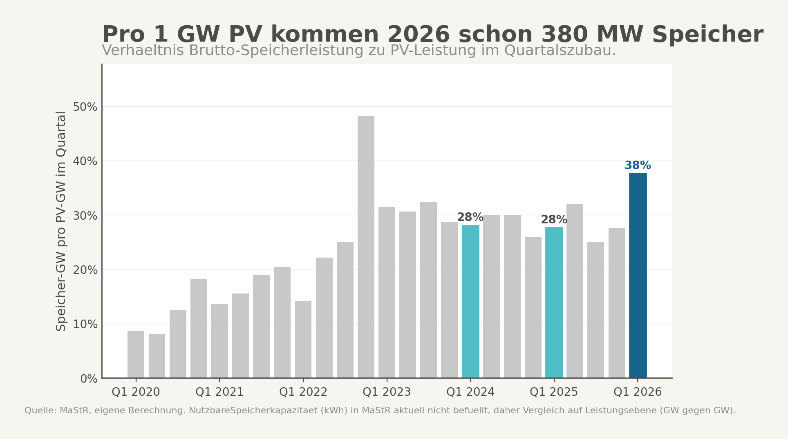
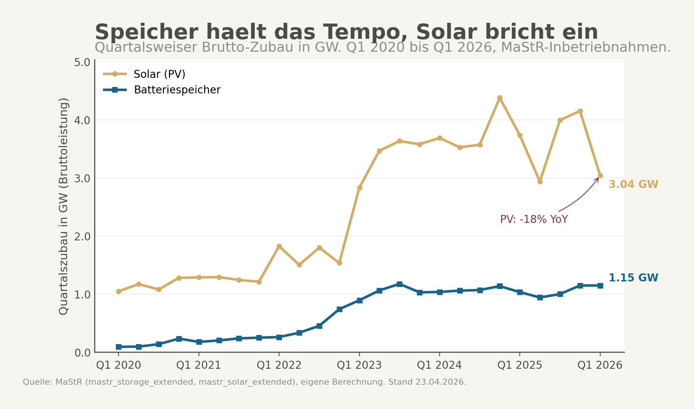

## Auslöser

Clean Energy Wire hat am 04.05.2026 in seiner Daily eine BSW-Solar-Auswertung der MaStR-Daten zitiert: PV-Zubau Q1 2026 minus 6% gegen Vorjahr, Batteriespeicher-Zubau plus 67%, Bestand jetzt 28 GWh ueber rund 2,5 Millionen Anlagen. Im selben Aufmacher fordert Carsten Koernig vom BSW, Batterien im geplanten Capacity-Market-Tender nicht zu diskriminieren. Zwei Tage zuvor hatte die Kanzlei Goerg den Referentenentwurf zum Stromversorgungs-Kapazitaetsgesetz (StromVKG) durchgearbeitet und festgehalten, dass die geplante Auktion fuer Langzeitkapazitaeten 10 Stunden Dauerleistung verlangt, eine Schwelle, die heutige Batteriespeicher faktisch ausschliesst. Drei Signale am selben Tag, die in dieselbe Richtung zeigen. Das hat mich in die MaStR-Rohdaten geschickt.

## Hauptbefund

Pro Gigawatt PV-Zubau kommen in Q1 2026 deutschlandweit 380 MW Batteriespeicher dazu. Das ist das hoechste Q1-Verhaeltnis seit 2020. In absoluten Zahlen aus dem Marktstammdatenregister: 3,04 GW PV gegen 1,15 GW Speicher. Vor einem Jahr waren es noch 3,73 GW PV und 1,03 GW Speicher, das Verhaeltnis lag bei 28%. Jetzt 38%.

Die Branche hat den Trend frueher entdeckt. BSW Solar meldet 3,51 GWp PV (-6% YoY) und ueber 2 GWh neuer Speicherkapazitaet (+67% YoY). Der Unterschied zwischen MaStR und BSW erklaert sich durch Nachmeldungsverzug. Die BNetzA rechnet bei aktuellen Monatsauswertungen standardmaessig 15% obendrauf. In den naechsten sechs Monaten korrigiert sich der MaStR-Wert erfahrungsgemaess um 10 bis 25% nach oben. Die Richtung bleibt aber stabil: PV gibt nach, Speicher haelt das Tempo.

Wichtige Einschraenkung gleich zu Anfang. Auf rollender 4-Quartals-Summe sind beide Reihen leicht negativ. Speicher minus 1,4% YoY, PV minus 7,1%. Das ist kein Crossover und kein "Speicher ueberholt Erzeugung". Das ist eine Tempo-Differenz. PV faellt fuenfmal schneller. Die strukturelle Bewegung steckt nicht im Wachstum, sondern im Verhaeltnis.





## Was der Mainstream-Frame verdeckt

Die politische Debatte um Versorgungssicherheit dreht aktuell um Gas. Der Capacity-Market-Entwurf des Wirtschaftsministeriums ist primaer als Gaskraftwerks-Tender konzipiert, mit dem Argument, Lastdeckung in Dunkelflauten brauche steuerbare thermische Erzeugung. Die 10-Stunden-Dauerleistungsregel im Referentenentwurf folgt aus dieser Logik. Sie bewertet Kapazitaet nach der Faehigkeit, ueber lange Phasen hinweg Strom zu liefern, nicht nach der Faehigkeit, Lastspitzen zu glaetten oder Erzeugungstaeler zu ueberbruecken.

Wer den Mainstream-Frame ernst nimmt, sieht das deutsche Speicher-Wachstum als Nebenkriegsschauplatz. Heimspeicher fuer Eigenverbrauchsoptimierung, ein bisschen Frequenzregelung. Nice to have, aber nicht systemkritisch. Genau diese Lesart trifft die aktuelle Marktbewegung nicht. Der MaStR-Befund Q1 2026 zeigt, dass der Investitions-Schwerpunkt sich verschiebt, ohne dass das Marktdesign mitzieht. Das Verhaeltnis 380 MW Speicher pro GW PV ist kein Lobby-Hype, es ist ein Stammdatenwert aus dem amtlichen Register.

Der zweite blinde Fleck ist segmentaler Natur. Der PV-Rueckgang kommt nicht aus der Flaeche, sondern aus den Daechern. Heim-PV minus 21% YoY, Gewerbedach minus 33%, Freiflaechen-PV plus 20%. Auf der Speicherseite spiegelbildlich: Heimspeicher stagnieren, Gewerbespeicher plus 40%, Grossspeicher fast verfuenffacht. Was aussieht wie ein PV-Speicher-Ausgleich, ist in Wahrheit ein Klassenwechsel. Stand-Alone-Grossspeicher boomen, waehrend das private Dach kollabiert. Der Mainstream-Frame "die Energiewende stockt" verfehlt beide Bewegungen gleichzeitig.

## Wo die eigentliche Diagnose liegt

Die Reform-Diagnose ist nicht "Speicher hat PV ueberholt". Die Diagnose ist subtiler. Erstens, das Marktdesign verguetet weiter vorrangig Erzeugung, der Markt baut aber Flexibilitaet. Zweitens, je laenger diese Luecke offen bleibt, desto teurer wird sie. Drittens, die regulatorische Fixierung auf 10 Stunden Dauerleistung sortiert genau die Asset-Klasse aus, die der Markt gerade in den Bestand schiebt.

Das StromVKG ist nicht durch Boeswilligkeit so geschnitten. Die 10-Stunden-Regel kommt aus der klassischen Versorgungssicherheitsrechnung mit Gaskraftwerken als Referenzanlage. Wer Backup ueber 10 Stunden braucht, hat Lastsituationen im Kopf, die einen Speicher ohne erneute Ladung leerlaufen lassen wuerden. Das ist im Kontext einer Dunkelflaute auch nicht falsch. Es macht nur die Asset-Klasse Batteriespeicher unfaehig zu kandidieren, obwohl genau diese Asset-Klasse aktuell den Investitions-Mainstream darstellt. Eine Auktion, in der nur Gaskraftwerke und ueberbaute Pumpspeicher antreten koennen, ist eine Auktion, die das Marktgeschehen aussortiert.

Die saubere Reform-Antwort ist nicht "Bedingungen lockern". Sie ist "Auktion segmentieren". Eine separate Spalte fuer Kurzzeitflexibilitaet, mit einer 2 bis 4-Stunden-Schwelle, mit eigener Mengenrechnung. Wer Last glaetten oder Frequenz halten will, braucht andere Anlagen als wer Erzeugungstaeler ueberbrueckt. Die Niederlande, Italien und Grossbritannien fahren ihre Capacity-Market-Tender mit segmentierten Kategorien. Deutschland faehrt eine pauschale Schwelle und produziert dadurch eine Verzerrung, die in den Stammdaten bereits ablesbar ist.

## Internationaler Vergleich

Wer den deutschen Verhaeltnis-Sprung von 28 auf 38% einordnen will, schaut nach UK und Australien. In Grossbritannien hat National Grid ESO im Herbst 2025 den ersten Capacity-Market-Tender mit explizit segmentierten Speicher-Kategorien gefahren, mit Mengenkontingenten fuer 2-Stunden- und 4-Stunden-Speicher separat von den Langzeit-Kategorien. Ergebnis: Speicher haben in der Kurzzeitkategorie rund 40% des ausgeschriebenen Volumens gewonnen, ohne mit Gaskraftwerken in derselben Spalte konkurrieren zu muessen.

In Australien ist die National Electricity Market-Statistik noch deutlicher. Der dortige Battery Storage Snapshot Q1 2026 weist Verhaeltnisse Speicher zu PV im Bereich von 50 bis 60% aus, getrieben durch Big-Battery-Programme der Bundesstaaten Victoria und South Australia. Australien hat dabei keine Capacity-Market-Schwelle, die Speicher ausschliesst, sondern arbeitet mit System Integrity Protection-Schemes, die Schnellreaktionsfaehigkeit explizit verguetemueber Tarife.

Das deutsche Verhaeltnis von 38% in Q1 2026 ist also weder ein Ausreisser nach oben noch ein gesattigter Wert. Es ist eine Etappe, die andere Maerkte schon hinter sich haben, und in beiden Vergleichsfaellen war regulatorische Anpassung Teil der Bewegung, nicht Ergebnis davon. Wenn das StromVKG in der jetzigen Form durchlaeuft, koppelt es sich gerade dort vom Markt ab, wo der Markt sich verschiebt.

## Was die Untersuchung gelernt hat

Die Hypothese ist im Verlauf in drei Punkten korrigiert worden.

Bestaetigt: Die Trendrichtung. PV gibt nach, Speicher haelt das Tempo, das Verhaeltnis sitzt strukturell hoeher als in jedem Q1 seit 2020. Sowohl MaStR als auch BSW Solar zeigen das, wenn auch mit unterschiedlichen Absolutwerten.

Relativiert: Die ursprungliche Behauptung "Speicher ueberholt Erzeugung in der Wachstumsrate". Auf der saisonbereinigten 4-Quartals-Summe sind beide Reihen leicht negativ. Es ist keine Wachstumsstory, sondern eine Verlangsamungsdifferenz. Die Investitionsrichtung des Marktes ist ablesbar, aber der Effekt ist niveau-basiert, nicht wachstumsbasiert.

Geschaerft: Die Kompositionsperspektive. Ohne den segmentalen Innenblick auf Heim-PV, Gewerbedach, Freiflaeche und auf Grossspeicher gegen Heimspeicher waere der Befund eindimensional. Der eigentliche Investitions-Shift ist ein Anlagenklassen-Shift, weg vom privaten Dach, hin zu utility-scale Stand-Alone-Speichern und Freiflaechen-PV. Das ist ein anderer Befund als "der Markt baut weniger PV", auch wenn es auf der GW-Aggregat-Ebene gleich aussieht.

## Grenzen

Drei Punkte schwaechen den Befund, ohne ihn zu kippen.

Erstens, die GWh-Achse. Die MaStR-Spalte `NutzbareSpeicherkapazitaet` ist nicht leer, wie bei einer ersten Datensichtung gedacht, sondern fehleranfaellig. RWTH Aachen (battery-charts.de) und Fraunhofer ISE werten dasselbe Feld regelmaessig aus, mit Bereinigungsfiltern fuer Einheitenfehler und manuelle Inkonsistenzen. Ohne diese Filter ist eine direkte Aggregation falsch, mit ihnen ist sie moeglich. Die GW-Achse ist konservativer und ohne Bereinigungsschritt belastbarer, aber sie unterschaetzt den Flexibilitaetszuwachs in Energie-Einheit. Bei steigenden Energie-zu-Leistung-Verhaeltnissen, also laenger werdenden Speichern, entsteht eine Luecke, die der GW-Vergleich nicht sieht.

Zweitens, der MaStR-BSW-Versatz. Q1 2026 zeigt 3,04 GW PV in MaStR-Rohdaten gegen 3,51 GWp bei BSW. Die Differenz von rund 13% liegt im Nachmeldungs-Erwartungswert der BNetzA. In sechs Monaten ist der MaStR-Wert hoeher, der BSW-Wert vermutlich gleich. Die Richtung wird sich nicht drehen, die absolute Hoehe schon.

Drittens, der Q1-Snapshot. Das gemessene Verhaeltnis 38% ist ein Quartalswert. Q1 2023 lag bei 31%, Q1 2024 und 2025 bei 28%. Die Reihe schwankt. Q3 2022 hatte einen Saisonal-Ausreisser bei 48%, der nicht als Vergleichsniveau taugt. Bevor "Trendbruch" robust behauptet werden kann, braucht es mindestens Q2 2026 und idealerweise Q3 2026 als Bestaetigung. Der jetzige Befund ist ein Hoechststand mit klarer Verschiebungsindikation, kein bestaetigter struktureller Bruch.

## Anhang A: Datenbasis und Vorgehen

Drei Rohquellen, zwei externe Branchenbefunde, ein Referentenentwurf.

Das Marktstammdatenregister liefert die Grundlage. Aus den Stammdaten wurden zwei Bestandsstroeme gefiltert: PV-Anlagen mit Inbetriebnahmedatum ab 2020 und Status In Betrieb, Speicheranlagen mit denselben Filtern. Die PV-Reihe nutzt Nettonennleistung in der Konvention von BNetzA und BSW. Die Speicher-Reihe nutzt Bruttoleistung, ebenfalls BSW-Konvention. Beide Reihen sind in Quartalsbuckets aggregiert, von Q1 2020 bis Q1 2026, Stand 23.04.2026.

Aus diesen Reihen wurden drei Metriken pro Quartal berechnet: PV-Zubau in GW, Speicher-Zubau in GW, Verhaeltnis Speicher pro PV. Fuer die Saisonalitaets-Kontrolle wurde zusaetzlich eine rollende 4-Quartals-Summe gebildet und auf dieser Summe das Vorjahresvergleichs-Wachstum berechnet. Die rollende 4Q-Summe glaettet Wetter- und Auftrags-Saisonalitaet, kann aber Foerder-getriebene Spruenge wie das BEG-Stop-Risiko von Q4 2024 nicht trennen.

Die externe Pruefung lief gegen zwei BSW-Solar-Pressemitteilungen vom 03.05.2026, eine fuer PV (3,51 GWp, -6% YoY) und eine fuer Speicher (>2 GWh, +67% YoY, Bestand 28 GWh). Plus eine Solarserver-Wiedergabe vom 04.05.2026, die den Grossspeicher-Anteil mit +270% YoY beziffert. Die Differenz zur MaStR-Rohzahl wurde gegen den BNetzA-Standardaufschlag von 15% (dokumentiert via pv-magazine.de vom 15.04.2026) abgeglichen und liegt im erwartbaren Korridor.

Der regulatorische Kontext kommt aus dem Goerg-Memorandum vom 24.04.2026 zum Referentenentwurf StromVKG. Dort sind die 10 Stunden Dauerleistung als Foerderbedingung fuer Langzeitkapazitaeten festgeschrieben. Diese Schwelle wurde in der Analyse mit der MaStR-Verteilung der Energie-zu-Leistung-Verhaeltnisse abgeglichen, soweit aus den Stammdaten plausibilisierbar.

## Anhang B: Verformelung der Berechnung

Drei Kennzahlen, eine Glaettung.

```text
zubau_GW(q, T) = sum( leistung_i / 1e6 ) fuer alle Anlagen i
                  mit Inbetriebnahmedatum_i in q
                  und Betriebsstatus_i = 'In Betrieb'

leistung_i = Nettonennleistung_i in kW   fuer T = Solar
leistung_i = Bruttoleistung_i    in kW   fuer T = Speicher

ratio(q) = zubau_GW(q, Speicher) / zubau_GW(q, Solar)

rolling_4q_GW(q, T) = zubau_GW(q, T)
                    + zubau_GW(q-1, T)
                    + zubau_GW(q-2, T)
                    + zubau_GW(q-3, T)

yoy_rolling_4q(q, T) = ( rolling_4q_GW(q, T) / rolling_4q_GW(q-4, T) ) - 1
```

Beispielrechnung Q1 2026:

```text
zubau_GW(Q1 2026, Solar)    = 3,04 GW
zubau_GW(Q1 2026, Speicher) = 1,15 GW
ratio(Q1 2026)              = 1,15 / 3,04 = 0,378  (38%, gerundet 380 MW pro GW PV)

rolling_4q_GW(Q1 2026, Solar)    = 14,12 GW
rolling_4q_GW(Q1 2025, Solar)    = 15,21 GW
yoy_rolling_4q(Q1 2026, Solar)   = -7,1%

rolling_4q_GW(Q1 2026, Speicher) = 4,23 GW
rolling_4q_GW(Q1 2025, Speicher) = 4,29 GW
yoy_rolling_4q(Q1 2026, Speicher) = -1,4%
```

Die Wahl Bruttoleistung statt Nettonennleistung fuer Speicher folgt der BSW-Konvention. Der Unterschied liegt in der Praxis bei rund 5 bis 7%. PV bleibt bei Nettonennleistung, weil BNetzA- und BSW-Statistiken sie so ausweisen. Eine Vergleichbarkeit Speicher-AC gegen PV-DC bleibt eine methodische Einschraenkung der GW-Ratio. Eine GWh-Sicht waere vergleichbarer, scheitert aber an der Bereinigungsbeduerftigkeit von `NutzbareSpeicherkapazitaet`.

Filter und Ausschluesse: Anlagen ohne Inbetriebnahmedatum oder ohne Betriebsstatus In Betrieb sind ausgeschlossen. Storno-Eintraege sind ausgeschlossen. Anlagen mit Inbetriebnahme vor 2020 sind ausgeschlossen, weil die Reihen fuer den Vergleich auf einen einheitlichen Zeitraum normiert sind.

## Quellen

- BSW Solar, "Schwacher Photovoltaik-Jahresauftakt", Pressemitteilung 03.05.2026, presseportal.de/pm/15347/6266886
- BSW Solar, "Rekordzubau bei Batteriespeichern", 03.05.2026, solarwirtschaft.de/2026/05/03/rekordzubau-bei-batteriespeichern-2/
- Clean Energy Wire, "Germany's solar installations drop while new battery storage hits record", 04.05.2026, cleanenergywire.org/news/germanys-solar-installations-drop-while-new-battery-storage-hits-record
- Solarserver, "Q1/26: Photovoltaik-Ausbau lahmt, Batteriespeicher boomen", 04.05.2026, solarserver.de/2026/05/04/q1-26-photovoltaik-ausbau-lahmt-batteriespeicher-boomen/
- pv magazine Deutschland, "Bundesnetzagentur erwartet 1411 Megawatt Photovoltaik-Zubau im Maerz", 15.04.2026, pv-magazine.de/2026/04/15/bundesnetzagentur-erwartet-1411-megawatt-photovoltaik-zubau-im-maerz/
- GOERG Rechtsanwaelte, "Kraftwerksstrategie konkretisiert sich: Referentenentwurf StromVKG", 24.04.2026, goerg.de/de/aktuelles/veroeffentlichungen/24-04-2026/kraftwerksstrategie-konkretisiert-sich-der-referentenentwurf-zum-stromvkg-liegt-vor
- Bundesnetzagentur, Marktstammdatenregister, Stand 23.04.2026, marktstammdatenregister.de
- Fraunhofer ISE, "Photovoltaik und Batteriespeicherzubau in Deutschland", 02/2024, ise.fraunhofer.de/content/dam/ise/de/documents/publications/studies/2024-02-photovoltaik-und-batteriespeicherzubau-in-deutschland.pdf
- RWTH Aachen, Battery Charts, battery-charts.de
- [2026-05-04_speicher-pv-relation-q1-2026](../speicher-pv-relation-q1-2026/)
- [2026-05-04_speicher-ueberholt-erzeugung-q1-2026](../speicher-ueberholt-erzeugung-q1-2026/)
- [2026-05-04_speicher-pv-relation-q1-2026_parallel](../speicher-pv-relation-q1-2026-parallel/)
- [2026-05-04_speicher-pv-relation-q1-2026_review](../speicher-pv-relation-q1-2026-review/)
